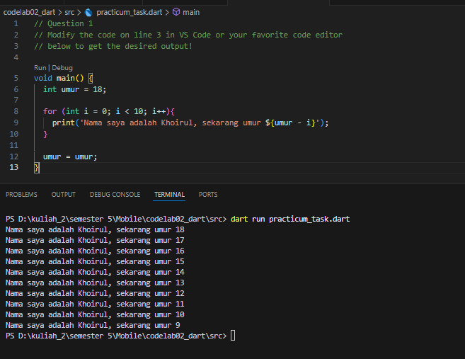
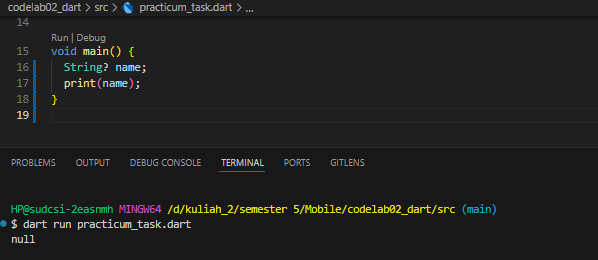
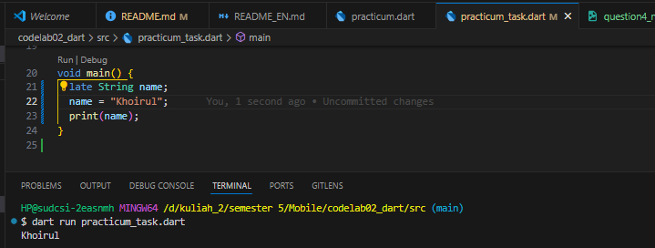

# Dart Practical Assignment

## Question 1
**Modify the code so the output matches your name:**

```dart
void main() {
  for (int i = 0; i < 5; i++) {
    print('Hello Khoirul Anwar ${i + 1}');
  }
}
```

**Output:**



---

## Question 2
**Why is it important to understand Dart before Flutter?**

Because **Flutter is built with Dart**, all Flutter application code is written in Dart. By understanding Dart:
- Easier to build widgets and manage the UI.  
- Supports debugging & the **hot reload** feature.  
- Understand OOP (Object-Oriented Programming) to create modular applications.  
- Reduce bugs and increase productivity.  

---

## Question 3
**Summary of Dart Material:**

1. **Dart is the core of Flutter** → modern, high-level language for web & mobile.  
2. **Key features:** productive tooling, garbage collection, type safety, portability.  
3. **History:** released in 2011, stable in 2013, Dart 2.0 (2018) → focused on mobile development.  
4. **How it works:** JIT (Just-In-Time) for development/hot reload, AOT (Ahead-Of-Time) for high performance.  
5. **Basic structure:**  
   - `main()` function is required.  
   - Supports OOP (class, object, method).  
   - Arithmetic, relational, and logical operators available.  
6. **Learning tool:** DartPad (https://dartpad.dev).  

---

## Question 4
**Difference between Null Safety and Late Variable**

### Null Safety
- By default, variables **cannot be null** unless marked with `?`.  
- Example:



### Late Variable
- A variable will be assigned **later**, but must have a value before being used.  
- Useful when a variable’s value will be set afterward.  
- Example:



**Difference:**
- **Null Safety (`?`)** → the variable can be empty (null).  
- **Late** → the variable cannot be null, but it is initialized later.  
