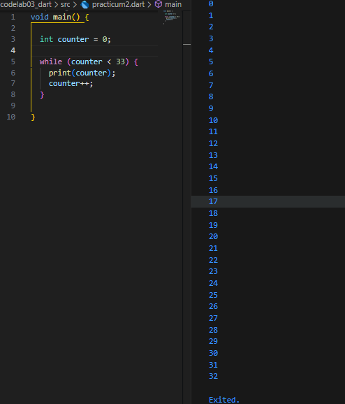

# Dart Practical Assignment

## Practicum 1: Menerapkan Control Flows ("if/else")

**Step 1**
**Type or copy the following program code into the main() function.**
```dart
  String test = "test2";
  if (test == "test1") {
    print("Test1");
  } else If (test == "test2") {
    print("Test2");
  } Else {
    print("Something else");
  }

  if (test == "test2") print("Test2 again");
```

**Step 2**
**Please try executing (Run) the code in step 1. What happens? Explain!**


**The program will encounter an error (cannot be run).**
**The error occurs because the keyword is written incorrectly.**
**In Dart, the correct form is else if (all lowercase letters).**
**else If and Else (uppercase letters) these are considered regular identifiers, not keywords.**

**Step 3**
**Add the following program code, then try executing (Run) your code.**

```dart
  String test = "true";
  if (test) {
    print("Kebenaran");
  }
```


## Practicum 2: Applying “while” and “do-while” Loops

**Step 1**
**Type or copy the following program code into the main() function.**

```dart
  while (counter < 33) {
    print(counter);
    counter++;
  }
```

**Step 2**
**Please try executing (Run) the code in step 1. What happens? Explain! Then fix it if an error occurs.**


**The program will encounter an error (cannot be run). The cause is that the counter variable has not been declared before being used in the while loop.**

**Repair**



**Step 3**
**Add the following program code, then try executing (Run) your code.**

```dart
  do {
    print(counter);
    counter++;
  } while (counter < 77);
```


## Practicum 3: Applying “for” and “break-continue” Loops

**Step 1**
**Type or copy the following program code into the main() function.**

```dart
  for (Index = 10; index < 27; index) {
    print(Index);
  }
```

**Step 2**
**Silakan coba eksekusi (Run) kode pada langkah 1 tersebut. Apa yang terjadi? Jelaskan! Lalu perbaiki jika terjadi error.**


**The program will encounter several errors:**
**Index and index differ in upper and lower case letters. Dart is case-sensitive, so Index ≠ index. This variable has never been declared. Incorrect increment index should be index++, not just index. No variable type index must be declared, for example int index = 10;**

**Repair:**


**Step 3**
**Add the following program code inside the for-loop, then try executing (Run) your code.**

```dart
  If (Index == 21) break;
  Else If (index > 1 || index < 7) continue;
  print(index);
```

**Apa yang terjadi ? Jika terjadi error, silakan perbaiki namun tetap menggunakan for dan break-continue.**


**The program will encounter an error due to the following reasons:**
**If, Else If → should be if, else if (lowercase letters). Index differs from index (Dart is case sensitive). The condition index > 1 || index < 7 is logically incorrect → because it will always be true (any number will definitely be >1 or <7).**

**Repair:**


