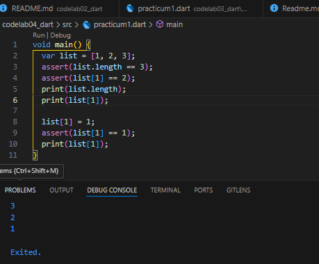
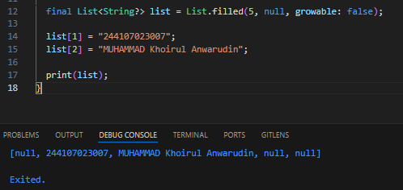

# Dart Practical Assignment

## Practice 1: Experiment Type Data List

**Step 1**

**Click or copy the code in the following programs void main().**
```dart
  var list = [1, 2, 3];
  assert(list.length == 3);
  assert(list[1] == 2);
  print(list.length);
  print(list[1]);

  list[1] = 1;
  assert(list[1] == 1);
  print(list[1]);
```

**Step 2:**

**Then try executing (Run) the code in step 1 above. What happened? Clear out!**

**assert does not return an error because all conditions are true. The output that appears in the console is:**



**Step 3**

**In this code step 1 becomes variable final which has index = 5 with default value = null. Same name as NIM and added elements of index 1 and 2. Then print and capture the result.**

**What happened? If error occurs, please correct.**



**index 0 = null**
**index 1 = 244107023007**
**index 2 = MUHAMMAD Khoirul Anwarudin**
**index 3 = null**
**index 4 = null**

## Practice 2: Experiment Type Data Set

**Complete the step-by-step tutorial below using VS Code or your favorite Code Editor.**

**Langkah 1:**
**Click or type the code in the following functions main().**
```dart
var halogens = {'fluorine', 'chlorine', 'bromine', 'iodine', 'astatine'};
print(halogens);
```

**Langkah 2:**
**Then try executing (Run) the code in step 1 above. What happened? Clear out! Then wait if error occurs.**

**Langkah 3:**
**Add the following code to the program, then try executing (Run) the following code.**
```dart
var names1 = <String>{};
Set<String> names2 = {}; // This works, too.
var names3 = {}; // Creates a map, not a set.
```

**print(names1);**
**print(names2);**
**print(names3);**
**What happened? If an error occurs, please correct it but still use the third variable. Add element name and NIM and give both variable sets with two different functions .add(). .addAll()To delete the variable Map, we will try this practical next.**

**Document the code and results in the console, then create a report.**