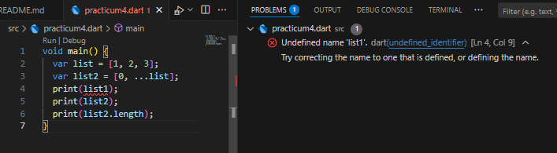
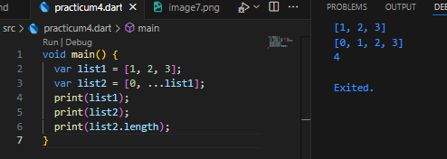

# Dart Practical Assignment

## Practice 1: Experiment Type Data List

**Step 1**

**Click or copy the code in the following programs void main().**
```dart
  var list = [1, 2, 3];
  assert(list.length == 3);
  assert(list[1] == 2);
  print(list.length);
  print(list[1]);

  list[1] = 1;
  assert(list[1] == 1);
  print(list[1]);
```

**Step 2:**

**Then try executing (Run) the code in step 1 above. What happened? Clear out!**

**assert does not return an error because all conditions are true. The output that appears in the console is:**


**Step 3**

**In this code step 1 becomes variable final which has index = 5 with default value = null. Same name as NIM and added elements of index 1 and 2. Then print and capture the result.**

**What happened? If error occurs, please correct.**


**index 0 = null**
**index 1 = 244107023007**
**index 2 = MUHAMMAD Khoirul Anwarudin**
**index 3 = null**
**index 4 = null**

## Practice 2: Experiment Type Data Set

**Complete the step-by-step tutorial below using VS Code or your favorite Code Editor.**

**Langkah 1:**
**Click or type the code in the following functions main().**
```dart
var halogens = {'fluorine', 'chlorine', 'bromine', 'iodine', 'astatine'};
print(halogens);
```

**Langkah 2:**
**Then try executing (Run) the code in step 1 above. What happened? Clear out! Then wait if error occurs.**


**When executed, there are no errors because Sets are immediately recognized by Dart. Halogens are Sets in Dart. Sets store unique data (no duplicates).**

**Langkah 3:**
**Add the following code to the program, then try executing (Run) the following code.**
```dart
var names1 = <String>{};
Set<String> names2 = {}; // This works, too.
var names3 = {}; // Creates a map, not a set.

print(names1);
print(names2);
print(names3);
```
**What happened? If an error occurs, please correct it but still use the third variable. Add element name and NIM and give both variable sets with two different functions .add(). .addAll()To delete the variable Map, we will try this practical next.**

**Document the code and results in the console, then create a report.**


**names1 is an empty Set of type String. We can add data with .add(). Result: {Khoirul, Anwar}**

**names2 is also a Set<String>, but we use .addAll() to add more than one element at a time. Result: {Budi, 20230123}**

**names3 uses {} without the <String>{} declaration, so it is considered an empty Map. Result: {name: Sinta, nim: 20231234}**

**Experiment objective: to understand the difference between Set and Map in Dart.**

**Results:**
**- names1 (Set with .add): adds one by one.**
**- names2 (Set with .addAll): adds multiple data at once.**
**- names3 (Map): stores data in key:value pairs, not Set.**

**Conclusion:**
**- Use <String>{} or Set<String> to create an empty Set.**
**- If only {} without a type is used, Dart automatically creates a Map, not a Set.**

## Practice 3: Experiment Type Data Maps
**Complete the step-by-step tutorial below using VS Code or your favorite Code Editor.**

**Langkah 1:**
**Click or type the code in the following functions main().**

```dart
var gifts = {
  // Key:    Value
  'first': 'partridge',
  'second': 'turtledoves',
  'fifth': 1
};

var nobleGases = {
  2: 'helium',
  10: 'neon',
  18: 2,
};

print(gifts);
print(nobleGases);
```

**Langkah 2:**
**Then try executing (Run) the code in step 1 above. What happened? Clear out! Then wait if error occurs.**


**There is no error, because Dart supports Maps with mixed keys and values (String or int).**

**Langkah 3:**
**Add the following code to the program, then try executing (Run) the following code.**

```dart
var mhs1 = Map<String, String>();
gifts['first'] = 'partridge';
gifts['second'] = 'turtledoves';
gifts['fifth'] = 'golden rings';

var mhs2 = Map<int, String>();
nobleGases[2] = 'helium';
nobleGases[10] = 'neon';
nobleGases[18] = 'argon';
```

**What happened? If error occurs, please correct.**

**Add element name and NIM and add each variable above ( gifts, nobleGases, mhs1, and mhs2). Document results and create reports!**


**Experiment objective: to understand how to create, update, and add data to a Map in Dart.**

**Results: gifts can store key:value pairs with keys in the form of Strings. nobleGases uses int keys. mhs1 and mhs2 prove that Maps can be defined with specific data types.**

**Conclusion: Maps in Dart store data in the form of key:value pairs. Keys must be unique, while values can be changed at any time. Map data types can be mixed (if not defined), or they can be specific (for example, Map<String, String>).**


## Practice 4: Experiment Type Data List: Spread and Control-flow Operators
**Complete the step-by-step tutorial below using VS Code or your favorite Code Editor.**

**Langkah 1:**
**Click or type the code in the following functions main().**

```dart
var list = [1, 2, 3];
var list2 = [0, ...list];
print(list1);
print(list2);
print(list2.length);
```

**Langkah 2:**
**Then try executing (Run) the code in step 1 above. What happened? Clear out! Then wait if error occurs.**



**error: Undefined name 'list1'**




**Langkah 3:**
**Add the following code to the program, then try executing (Run) the following code.**

```dart
list1 = [1, 2, null];
print(list1);
var list3 = [0, ...?list1];
print(list3.length);
```

**What happened? If error occurs, please correct.**

**Add variable list containing NIM and use Spread Operators. Document results and create reports!**


**...? is used so that if the list is null, there will be no error. The new list with NIM has been successfully merged.**

**Langkah 4:**
**Add the following code to the program, then try executing (Run) the following code.**


```dart
var nav = ['Home', 'Furniture', 'Plants', if (promoActive) 'Outlet'];
print(nav);
```

**What happened? If error occurs, please correct. Show result if variable promoActivewhen truegiven false.**


**if (promoActive) is used to control conditions within the list.**

**Langkah 5:**
**Add the following code to the program, then try executing (Run) the following code.**


```dart
var nav2 = ['Home', 'Furniture', 'Plants', if (login case 'Manager') 'Inventory'];
print(nav2);
```

**What happened? If error occurs, please correct. Show results if the variable loginhas other conditions.**


**If login == ‘Manager’, then ‘Inventory’ is added. Otherwise, the list only contains the default.**

**Langkah 6:**
**Add the following code to the program, then try executing (Run) the following code.**

```dart
var listOfInts = [1, 2, 3];
var listOfStrings = ['#0', for (var i in listOfInts) '#$i'];
assert(listOfStrings[1] == '#1');
print(listOfStrings);
```

**What happened? If error occurs, please correct. Clear benefit collection for and documentation results.**


**For-loops in list comprehensions are used to create new lists from old lists.**

**Steps 1–3: The spread operator (... and ...?) is used to copy the contents of the list. ...? prevents errors if the list is null.**
**Steps 4–5: Control-flow operators (if) can be used within lists. This is very useful for conditions such as active promotions or login roles.**

**Step 6: Collection for is used to generate a new list from a loop, similar to list comprehension in other languages (Python).**

<hr/>

## Practice 5: Experiment Type Data Records
**Note: Type data records started introduced in Dart version 3.0. Make sure you are set up using Dart 3.0 or newer.**

**Complete the step-by-step tutorial below using VS Code or your favorite Code Editor.**

**Langkah 1:**
**Click or type the code in the following functions main().**

```dart
var record = ('first', a: 2, b: true, 'last');
print(record)
```

**Langkah 2:**
**Then try executing (Run) the code in step 1 above. What happened? Clear out! Then wait if error occurs.**


**Error: Expected ';' after this.**


**Langkah 3:**
**Add the following code to the program outside the scope void main(), then try executing (Run) the next code.**

```dart
(int, int) tukar((int, int) record) {
  var (a, b) = record;
  return (b, a);
}
```

**What happened? If error occurs, please correct. Use the function tukar()inside main()to clearly see the process of changing value fields in records.**


**The swap function successfully reverses the position of the value in the record.**

**Langkah 4:**
**Add the following code program in the scope void main(), then try executing (Run) this code.**

```dart
// Record type annotation in a variable declaration:
(String, int) mahasiswa;
print(mahasiswa);
```

**What happened? If error occurs, please correct. Initialization fields name and NIM are given to the variable record mahasiswaabove. Document results and create reports!**


**If not initialized, an error will occur:**
**Error: Non-nullable variable ‘student’ must be assigned before it can be used.**

**Therefore, it must be given an initial value immediately.**

**Langkah 5:**
**Add the following code program in the scope void main(), then try executing (Run) this code.**

```dart
var mahasiswa2 = ('first', a: 2, b: true, 'last');

print(mahasiswa2.$1); // Prints 'first'
print(mahasiswa2.a); // Prints 2
print(mahasiswa2.b); // Prints true
print(mahasiswa2.$2); // Prints 'last'
```
**What happened? If error occurs, please correct. Change one of the same records with name and NIM and then document the results and create reports!**


**Step 1–2: Records are a new data type in Dart 3. They can hold both positional fields and named fields.**

**Step 3: The swap function demonstrates destructuring on records, then returns the swapped values.**

**Step 4: Records can be given type annotations (String, int) and must be initialized.**

**step 5: Record fields can be accessed via $1, $2 (position) or name (a, b).**

<hr>

## 2. Explain what Functions mean in the Dart language! 

**Functions in Dart are blocks of code designed to perform specific tasks and can be called repeatedly without rewriting the same logic. Functions help make code more structured, easier to read, and more efficient. In Dart, functions can be defined with the keyword void if they do not return a value, or with a specific data type if they return a value.**

<hr>

## 3. Explain the types of parameters in Functions along with syntax examples!

**- Positional parameter: a regular parameter whose order must be correct when calling a function.**
```dart
void halo(String nama, int umur) {
  print("Halo $nama, umur kamu $umur tahun");
}
```
**- Optional positional parameter: an optional parameter written in square brackets [].**
```dart
void greet(String nama, [String? pesan]) {
  print("Halo $nama ${pesan ?? ''}");
}
```
**- Named parameter: a parameter called by specifying the variable name in curly brackets {}. Usually used for clearer code.**
```dart
void register({required String nama, int umur = 0}) {
  print("Nama: $nama, Umur: $umur");
}
```

<hr>

## 4. Explain what Functions are as first-class objects, along with syntax examples!

**In Dart, functions are treated as first-class objects. This means that functions can be stored in variables, passed as arguments to other functions, or returned as return values. This makes functions very flexible. Example:**

```dart
void cetakPesan(String pesan) {
  print(pesan);
}

void jalankanFungsi(void Function(String) fungsi, String data) {
  fungsi(data);
}

void main() {
  var f = cetakPesan;
  f("Halo Dunia");
  jalankanFungsi(cetakPesan, "Pesan lewat parameter function");
}

```

<hr>

## 5. What are Anonymous Functions? Explain and provide examples!

**An anonymous function is a function that does not have a name. It is typically used for simple operations or as a parameter for another function (e.g., callback). Anonymous functions are written directly without defining a function name. Example:**
```dart
void main() {
  var daftar = ['A', 'B', 'C'];
  daftar.forEach((item) {
    print("Huruf: $item");
  });
}
```

<hr>

## 6. Explain the difference between Lexical scope and Lexical closures! Provide examples!

**- Lexical Scope means that variables can only be accessed according to the location (scope) where the variable is defined. Example:**
```dart
void main() {
  var nama = "Budi";
  void sapa() {
    print("Halo $nama");
  }
  sapa();
}
```

**- Lexical Closure is a function that “remembers” variables from the scope in which it was created, even though that scope has already been executed. Example:**
```dart
Function buatCounter() {
  int count = 0;
  return () {
    count++;
    return count;
  };
}

void main() {
  var counter = buatCounter();
  print(counter());
  print(counter());
}
```
**The main difference: lexical scope focuses on variable access rules based on code location, while lexical closure allows functions to “carry” data from the outer scope even though that scope is no longer active.**

<hr>

## 7. Explain with examples how to create multiple return values in Functions!
**Dart cannot return multiple values at once, but there are several ways to do so. The common methods are to return a List, Map, or use a Tuple (from an additional package). Example using List:**

```dart
List<int> hitung(int a, int b) {
  return [a + b, a - b, a * b];
}

void main() {
  var hasil = hitung(6, 3);
  print("Tambah: ${hasil[0]}, Kurang: ${hasil[1]}, Kali: ${hasil[2]}");
}
```