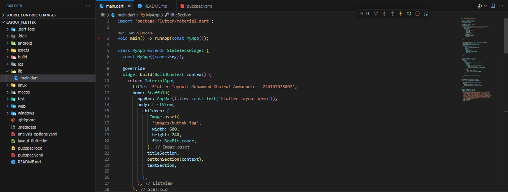
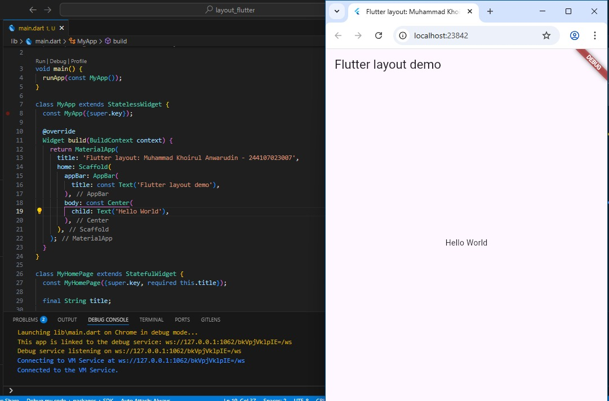
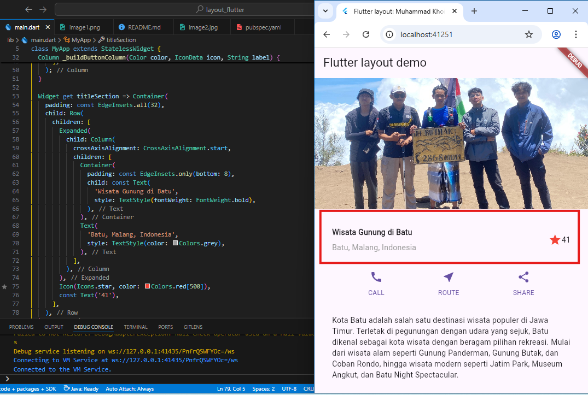
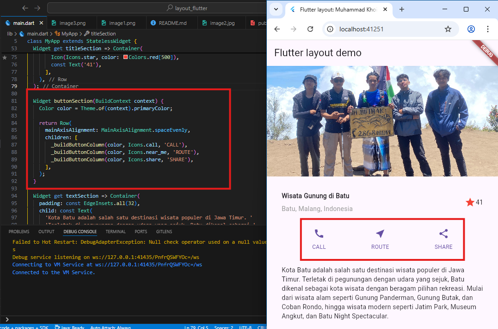
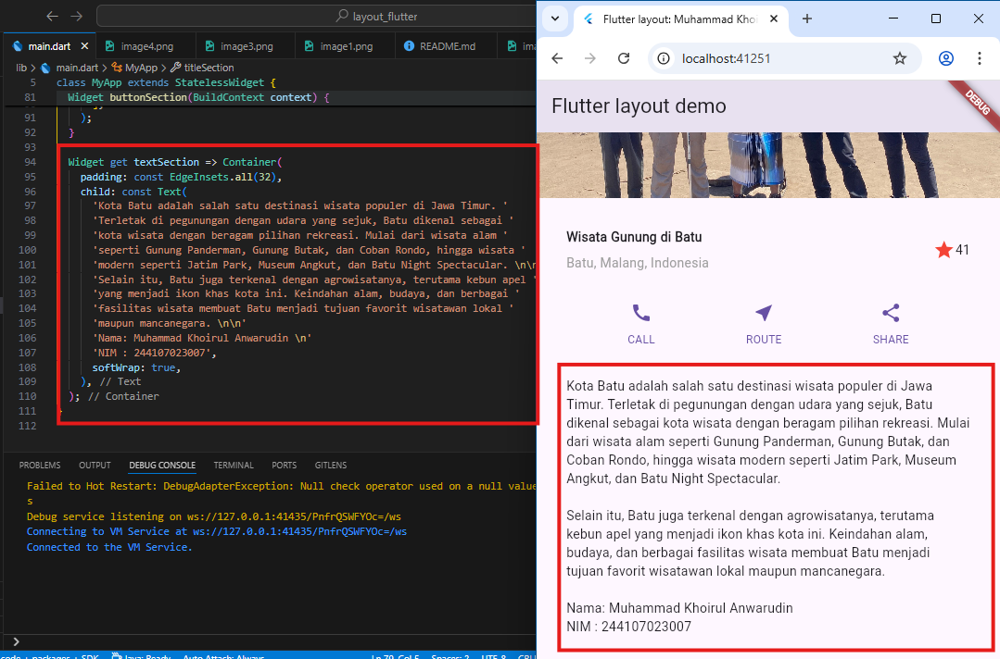
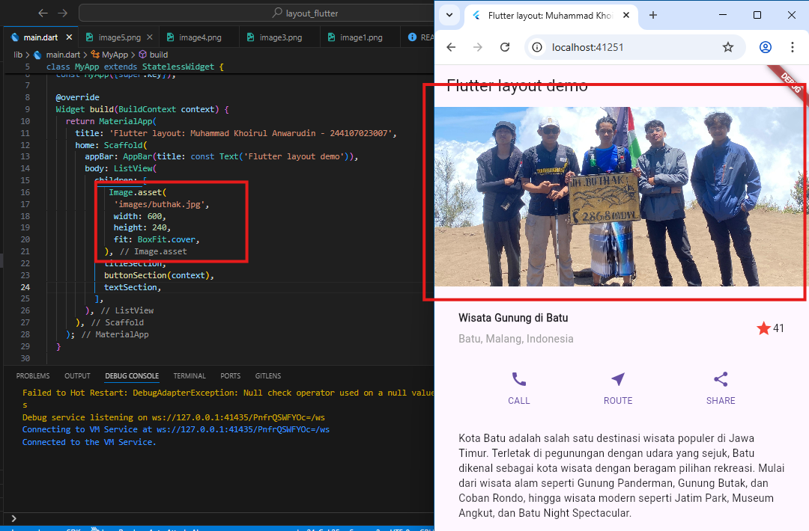
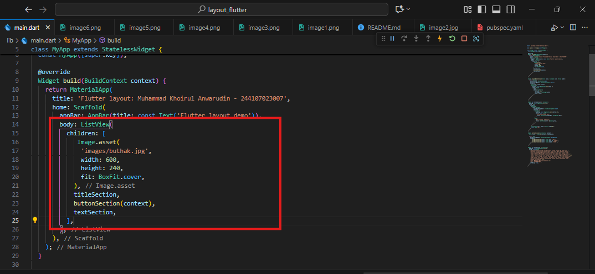

Name : Muhammad Khoirul Anwarudin
NIM  : 244107023007

## Practical 1-4: Building Layouts in Flutter (Project: `layout_flutter`)

Step 1: Create a New Project

Create a new Flutter project named `layout_flutter`.

Step 2: Open the `lib/main.dart` file

The initial code displays “Hello World” in the center of the screen.

Step 3: Identify the Layout Diagram

Identify the basic layout elements (columns, rows, etc.).
Explanation: Analyze the structure of the UI to be created.

Step 4: Implementing the Title Row

Implementation of the title section with text and icons

The title section contains a text field, a star icon, and a rating number.

Step 5: Implementing the Button Row

Implementation of button rows with icons and text.

The button row contains the CALL, ROUTE, and SHARE buttons with their respective icons.

Step 6: Implementing the Text Section

Implementation of text sections with descriptions.

Add a section of text containing a description of the tourist attraction.

Step 7: Implementing the Image Section

Adding images as part of the layout.

Adding landscape images to the layout.

Step 8: Convert to ListView

All elements are arranged in a `ListView` so that they can be scrolled.

Change Column to ListView so that the display can be scrolled on devices with low resolution.

## Layout Basic

This Flutter application uses widgets to build the UI: MyApp as the entry point that sets the theme and home screen, IntroductionPage to display an introductory layout with text and images from the internet, and BuildLayoutPage which explains the basic steps and examples of “Hello World”, where these three pages use basic widgets such as Scaffold, AppBar, Column, and Text to create the basic structure of the application in accordance with Material Design guidelines, as well as showing the basic layout of widgets and displaying content. while to create a dynamic floating app bar, the CustomScrollView widget is combined with SliverAppBar (which has floating capabilities) and SliverList to create a scrollable list, allowing users to hide or display the app bar when scrolling through the list.

## Practicum 5: Building Navigation in Flutter (Project: `shopping`)

During practicum 5 and practicum assignment 2, I successfully created a “shopping” application in Flutter that has navigation between pages using named routes. This application allows users to navigate from the product list on the HomePage to the product details on the ItemPage, while retaining the product information. Additionally, I enhanced the application by adding photo, stock, and rating attributes to the products, modifying the product list view to a GridView to resemble a marketplace application, and incorporating engaging animations using the Hero widget. I also experimented with routing using the go_router plugin as an alternative to Flutter's built-in navigation method, and didn't forget to add my name (Muhammad Khoirul Anwarudin) and student ID (2441070230007) in the app's footer as identification.

