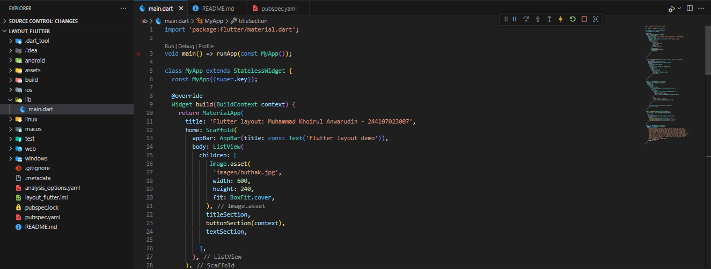
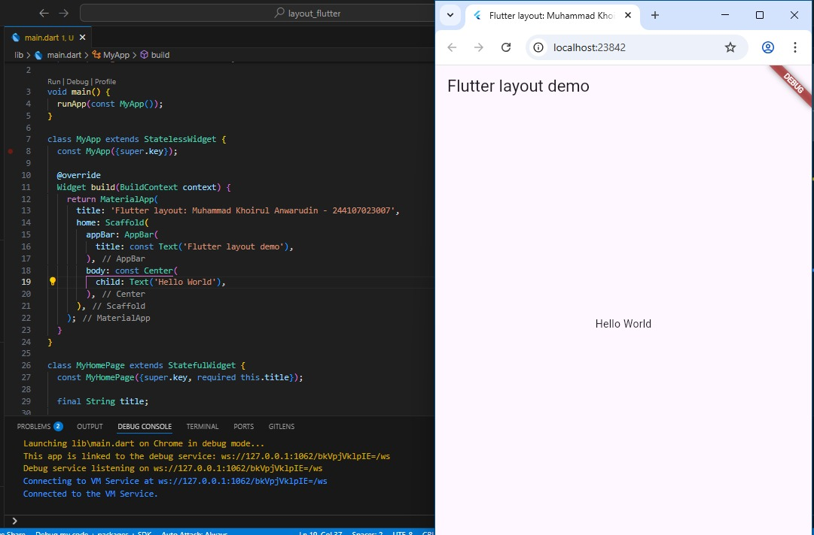
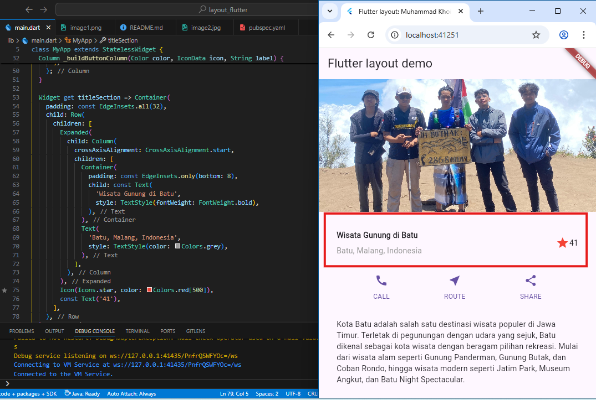
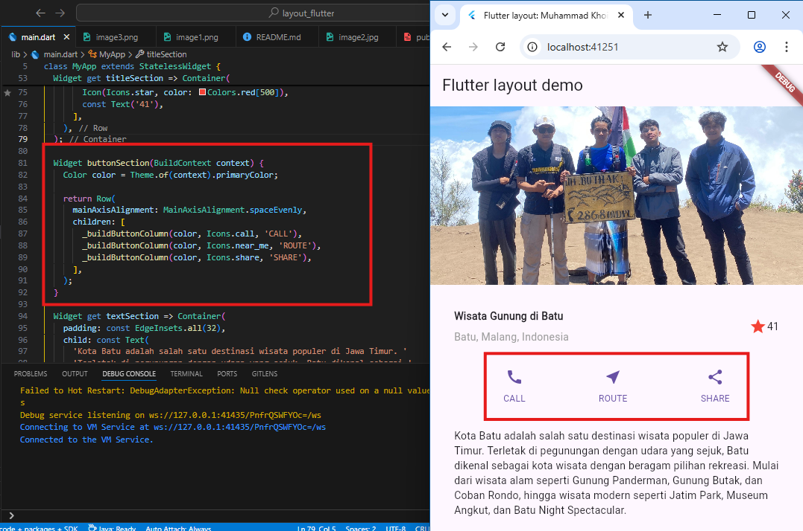
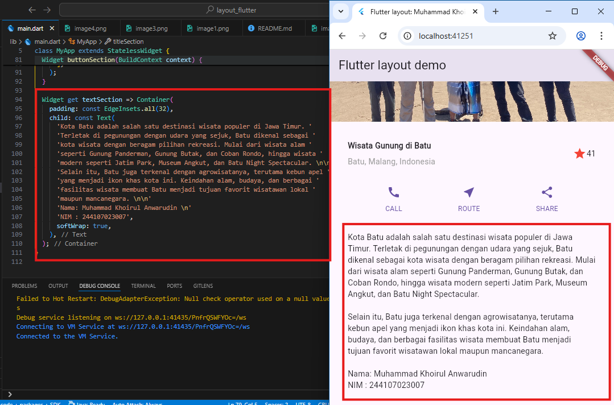
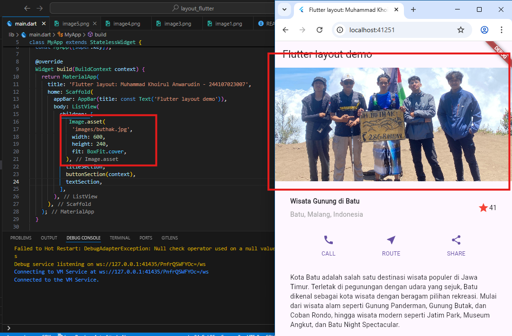
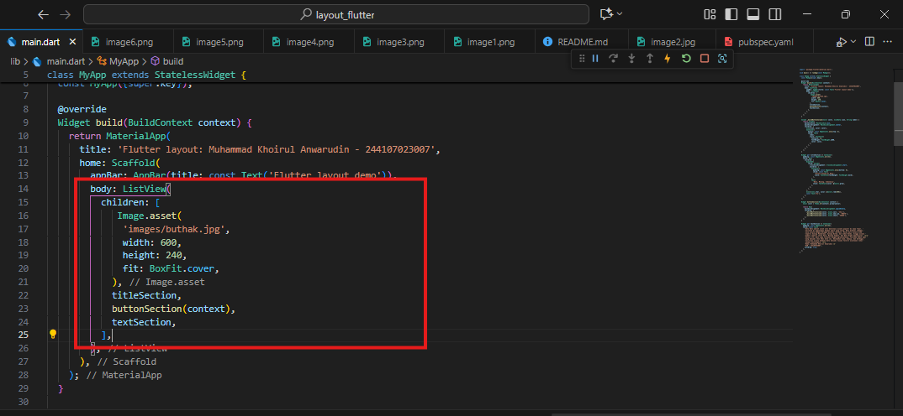

# layout_flutter

A new Flutter project.

## Getting Started

This project is a starting point for a Flutter application.

A few resources to get you started if this is your first Flutter project:

- [Lab: Write your first Flutter app](https://docs.flutter.dev/get-started/codelab)
- [Cookbook: Useful Flutter samples](https://docs.flutter.dev/cookbook)

For help getting started with Flutter development, view the
[online documentation](https://docs.flutter.dev/), which offers tutorials,
samples, guidance on mobile development, and a full API reference.

## Practical 1-4: Building Layouts in Flutter (Project: `layout_flutter`)

Step 1: Create a New Project

Create a new Flutter project named `layout_flutter`.

Step 2: Open the `lib/main.dart` file

The initial code displays “Hello World” in the center of the screen.

Step 3: Identify the Layout Diagram

Identify the basic layout elements (columns, rows, etc.).
Explanation: Analyze the structure of the UI to be created.

Step 4: Implementing the Title Row

Implementation of the title section with text and icons

The title section contains a text field, a star icon, and a rating number.

Step 5: Implementing the Button Row

Implementation of button rows with icons and text.

The button row contains the CALL, ROUTE, and SHARE buttons with their respective icons.

Step 6: Implementing the Text Section

Implementation of text sections with descriptions.

Add a section of text containing a description of the tourist attraction.

Step 7: Implementing the Image Section

Adding images as part of the layout.

Adding landscape images to the layout.

Step 8: Convert to ListView

All elements are arranged in a `ListView` so that they can be scrolled.

Change Column to ListView so that the display can be scrolled on devices with low resolution.

## Practicum 5: Building Navigation in Flutter (Project: `shopping`)

