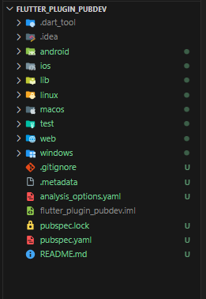
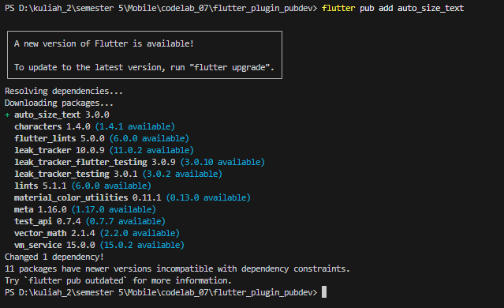
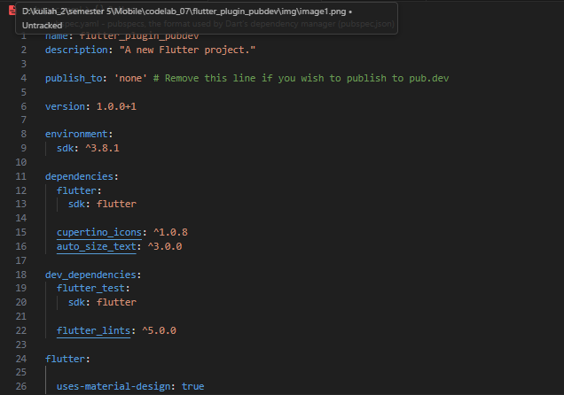
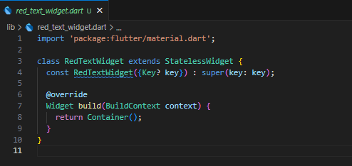
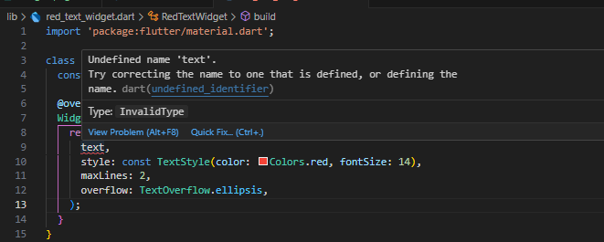
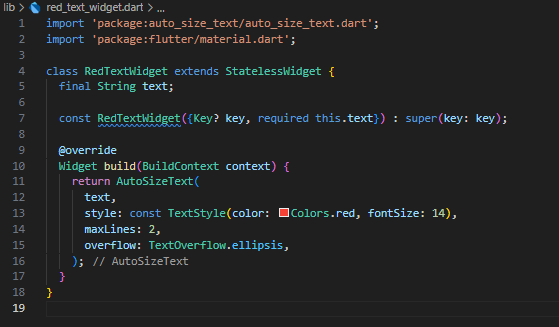
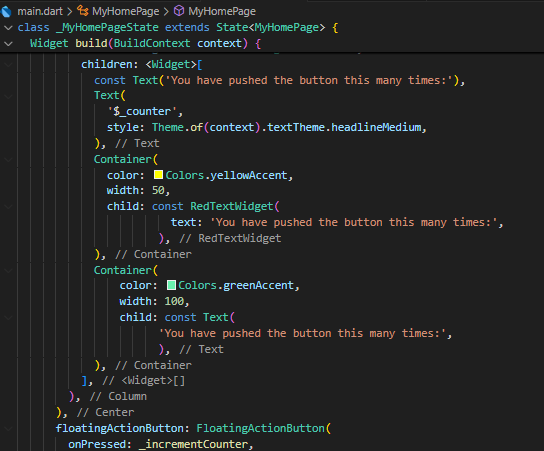
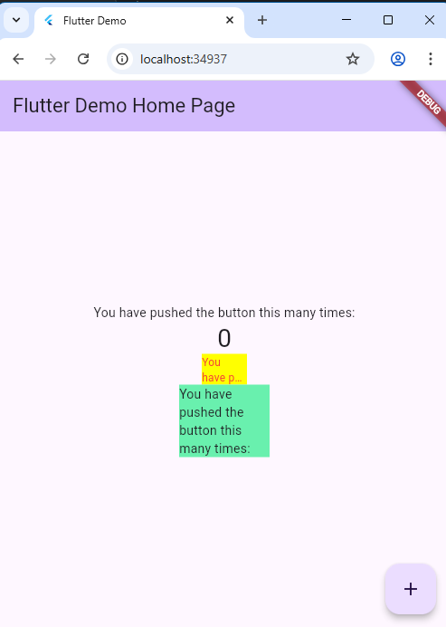

Name : Muhammad Khoirul Anawarudin

NIM  : 2441070230007


# **Practical Work: Applying Plugins in Flutter Projects**

**Step 1: Create a New Project**

Create a new Flutter project named flutter_plugin_pubdev. Then make it a repository on your GitHub with the name flutter_plugin_pubdev.



**Step 2: Adding Plugins**

Add the auto_size_text plugin using the following command in the terminal





flutter pub add auto_size_text: This command is used in the terminal to automatically add a plugin named auto_size_text as a project dependency. Flutter will download the plugin from pub.dev (Flutter's package repository) and update the project's pubspec.yaml file with the newly added plugin information. By adding this plugin, developers can use the AutoSizeText widget in their applications, which automatically adjusts the text size to fit within the available space.

**Step 3: Create the red_text_widget.dart file**



**Step 4: Add the AutoSizeText Widget**

Still in the red_text_widget.dart file, to use the auto_size_text plugin, change the return Container() code to the following.

```dart
return AutoSizeText(
      text,
      style: const TextStyle(color: Colors.red, fontSize: 14),
      maxLines: 2,
      overflow: TextOverflow.ellipsis,
);
```



In step 4, after adding the AutoSizeText code, you will get an error because:

The text variable has not been defined: The AutoSizeText widget requires a text parameter to display text. However, in the initial code in step 3, the RedTextWidget class does not have a declared text variable. Therefore, when AutoSizeText tries to access the text variable, it cannot find it, causing an error.
The constructor has not received the text parameter: Since the text variable does not exist, the RedTextWidget constructor has not been configured to receive the text value when the widget is created. As a result, it cannot provide a value for the text property of AutoSizeText when using RedTextWidget.

**Step 5: Create text variables and parameters in the constructor**

Add text variables and parameters in the constructor as follows.



**Step 6: Add the widget in main.dart**





# **Practical Assignment**

**1. Complete the practicum, then document it and push it to your repository in the form of screenshots of your work along with explanations in the README.md file!**

**2. Explain the purpose of step 2 in the lab!**

Step 2 aims to add the auto_size_text plugin to the Flutter project. A plugin is a code package that can be used to add additional functionality to an application without having to write code from scratch. In this case, the auto_size_text plugin allows you to create text that automatically adjusts its size to fit the available space.
The command flutter pub add auto_size_text will update the project's pubspec.yaml file by adding a dependency to the auto_size_text plugin, and then automatically run flutter pub get to download the plugin into the project.

**3. Explain the purpose of step 5 in the practicum!**

Step 5 aims to add the text variable and corresponding parameters to the RedTextWidget widget constructor. The goal is to make this widget more flexible and usable for displaying different texts.
Adding the text parameter to the constructor provides the text value that will be displayed by the widget when it is created. This makes it possible to use RedTextWidget with different texts in various places in the application.
The required keyword ensures that every time the RedTextWidget widget is created, a value for the text parameter must be provided. This helps prevent errors and ensures that the widget always has text to display.

**4. In step 6, two widgets are added. Explain their functions and differences!**

The widgets added in step 6 are RedTextWidget and Text. The main differences between these two widgets are:

RedTextWidget is a custom widget that uses the auto_size_text plugin to automatically adjust the text size to fit the available space. This widget always displays red text.
Text is a built-in Flutter widget that displays simple text without automatic size adjustment. It can customize the text appearance using the style property.

**5. Explain the meaning of each parameter in the auto_size_text plugin based on the link in this documentation!**

Constructors AutoSizeText.new and AutoSizeText.rich:

Both of these constructors essentially have the same parameters. AutoSizeText.new is used for plain text (String), while AutoSizeText.rich is used for richer formatted text with TextSpan. Here's an explanation of the parameters:

**data (specific to AutoSizeText.new):** The text to display. It's of type String? (nullable String), meaning it can be text or null.
textSpan (specific to AutoSizeText.rich): The text to display, formatted as a TextSpan. TextSpan allows you to apply different styles to various parts of the text.

**key:** A key used by Flutter to identify the widget. Useful when the widget is moved within the tree. If you don't have a specific reason, this parameter can be ignored.

**textKey:** A key that will be applied to the Text widget that theAutoSizeText create. This allow you to control text widget specifically.

**style:** Text style (TextStyle) such as color, font, size (size will be overridden by auto-sizing), etc. If not provided, it will use the default theme style.

**strutStyle:** Defines the minimum height of a line of text. Rarely used, but useful for precisely controlling the vertical layout of text.

**minFontSize:** The smallest font size allowed when the text is resized. The default is 12.0.

**maxFontSize:** The largest font size allowed. The default is double.infinity (unlimited).

**stepGranularity:** How fine the changes in font size are. For example, stepGranularity = 0.5 means the font size will only change in increments of 0.5 (12.0, 12.5, 13.0, etc.). The default is 1.0.

**presetFontSizes:** A list of font sizes (List<double>) to use. If provided, auto-sizing will only use these sizes. This is useful if you want tighter control over the possible font sizes.

**group:** An AutoSizeGroup object used to synchronize the font sizes of several AutoSizeText widgets simultaneously. If multiple AutoSizeText widgets use the same AutoSizeGroup, they will have the same font size.

**textAlign:** Horizontal text alignment (TextAlign). Choices: left, right, center, justify, etc.

**textDirection:** The direction of the text (TextDirection). Important for right-to-left languages ​​like Arabic or Hebrew.

**locale:** The locale (language and region) used to select the appropriate font. Useful if Unicode characters can be rendered differently depending on the locale.

**softWrap:** Whether the text should be broken at line breaks. If true, the text will automatically move to a new line if it is too long. If false, the text will overflow.

**wrapWords:** Whether words that don't fit on one line should be broken. The default is true. If false, words will overflow even if there is empty space on the next line.

**overflow:** How to handle overflowing text (TextOverflow). Choices: clip (clipped), fade (fade out), ellipsis (displays "..."), or visible (remain displayed even if overflowing).

**overflowReplacement:** The widget to display instead of the text if the text overflows.

**textScaleFactor:** A scale factor applied to the font size. Affects how large the text is displayed.

**maxLines:** The maximum number of lines allowed for the text. If the text exceeds this number of lines, the text will be resized according to the constraints given, and if it still overflows, it will be clipped according to the overflow property.

**semanticsLabel:** An alternative semantic label for this text. Useful for accessibility (screen readers).