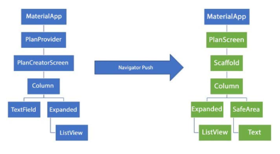

**Name: Muhammad Khoirul Anwarudin**

**Class: TI 3I**

**NIM: 244107023007**

# Master Plan App: Flutter State Management Labs

This document explains the key concepts and results from the state management practicum, evolving from a simple `setState` to `InheritedNotifier` for multi-screen state.

## Lab 1: Basic State with Model-View

This lab focused on building the basic app structure using a `StatefulWidget` and `setState` to manage the state of a single screen.

### Explanation of Step 4 (`data_layer.dart`)

Step 4 creates the `data_layer.dart` file to **simplify model imports**.

Instead of importing `plan.dart` and `task.dart` separately into other files (like `plan_screen.dart`), we can just import the single `data_layer.dart` file. This keeps the code cleaner and more manageable, especially as the number of models grows.

### Explanation of the `plan` Variable (Step 6)

The `plan` variable is the **data store (state)** for the `PlanScreen`. It holds the `Plan` object, which in turn stores the list of `tasks` currently displayed on the screen.

It is initialized with `const Plan()` as its **default value**, representing an empty plan when the app first loads. This variable is *not* a constant (it isn't declared with `final` or `const`) so its value can be updated using `setState` every time a task is added or changed.

### Step 9 Result (GIF)

<video controls src="img/Video WhatsApp 2025-11-03 pukul 14.41.19_522a022f.mp4" title="Title"></video>

* **`+` Button (FloatingActionButton):** When pressed, it adds a new, empty task row to the list.
* **Task List:** Each task row has:
    * **Checkbox:** Can be checked to update the task's `complete` status.
    * **TextFormField:** Allows typing to set the task's `description`.
* Every interaction (pressing the button, typing, or checking the box) immediately updates the UI because it triggers `setState`.

### Purpose of `initState()` and `dispose()` (Steps 11 & 13)

These are both important methods in the `StatefulWidget` lifecycle:

* **`initState()` (Step 11):** This method is called **once** when the widget is first created and inserted into the widget tree. It's used for one-time initialization, such as creating the `ScrollController` and adding its listener.
* **`dispose()` (Step 13):** This method is called when the widget is about to be permanently removed. It's used to **clean up** resources (like the `scrollController`) to **prevent memory leaks**.

---

## Lab 2: Managing the Data Layer with InheritedWidget

This lab refactored the app to separate the state from the UI, moving state management from `setState` to an `InheritedNotifier` (`PlanProvider`).

### Explanation of `InheritedWidget` (Step 1)

* **Which one is the `InheritedWidget`?**
    `PlanProvider` is our `InheritedWidget`. Technically, `PlanProvider` extends `InheritedNotifier`, which itself extends `InheritedWidget`.

* **Why `InheritedNotifier`?**
    We use `InheritedNotifier` because it's a specialized version of `InheritedWidget` designed to **listen for changes on a `Listenable`** (in our case, a `ValueNotifier`).

    When the value inside our `ValueNotifier` (which holds the `Plan` data) changes, the `InheritedNotifier` automatically knows how to notify all descendant widgets (like `PlanScreen`) that they need to rebuild with the new data. This is much more efficient and automatic than using a plain `InheritedWidget`.

### Explanation of Methods (Step 3)

These are **derived properties (getters)** that function to calculate task progress.

* `completedCount`: Calculates how many tasks have been checked (have a `complete: true` status).
* `completenessMessage`: Creates a summary string of the progress (e.g., "2 out of 5 tasks").

**Why do this?** This is good practice for **separating business logic from the UI (View)**. Instead of having the `PlanScreen` (UI) responsible for calculating the progress, the logic is moved into the model (`Plan`). The `PlanScreen` only needs to grab the final result (`plan.completenessMessage`) to display it.

### Step 9 Result (GIF)

<video controls src="img/Video WhatsApp 2025-11-03 pukul 14.22.58_36d3deca.mp4" title="Title"></video>

The main difference is: there is now **progress text at the bottom of the screen** (e.g., "0 out of 0 tasks").

When you:
* Press the `+` button to add a task, the text updates (e.g., "0 out of 1 tasks").
* Check a task's `Checkbox`, the text updates again (e.g., "1 out of 1 tasks").

This proves that the state (the `Plan` data) is now managed by `PlanProvider`, and the UI (`PlanScreen`) is automatically "listening" and reacting to data changes via the `ValueListenableBuilder`.

---

## Lab 3: Managing State Across Multiple Screens

This lab "lifted the state up" so that the `PlanProvider` could manage a `List<Plan>`, allowing the app to support multiple plan screens.

### Diagram Explanation

This diagram explains the app's navigation flow and widget structure:

* **Blue Side (Left):** This is the main screen or "master view" (`PlanCreatorScreen`). It sits under `PlanProvider` (which holds all the data) and contains a `Column` with a `TextField` (to add new plans) and a `ListView` (to display all existing plans).
* **Arrow (Middle):** This represents the `Navigator.push` action. It occurs when you tap an item in the blue `ListView` (Step 14).
* **Green Side (Right):** This is the "detail view" (`PlanScreen`) that is "pushed" on top of the main screen. It displays a `Column` with a `ListView` (of tasks) and `Text` (progress status) for the *single plan* that was selected.

**In short: The diagram shows the flow from seeing all plans (blue) to seeing the details of one plan (green) via navigation.**

### Step 14 Result (GIF)

<video controls src="img/Video WhatsApp 2025-11-03 pukul 14.22.57_6f5aa0d3.mp4" title="Title"></video>

* **Initial Screen:** Displays the message "You don't have any plans yet." with an icon.
* **Adding a Plan:** You type a new plan name (e.g., "Testing") into the top `TextField` and press enter.
* **List Updated:** The "Testing" plan immediately appears in the `ListView` below, complete with its progress status (e.g., "0 out of 0 tasks").
* **Navigation:** When you tap the "Testing" `ListTile`, the app navigates to the detail screen (`PlanScreen`), which now shows "Testing" as its title.