# Nama: Muhammad Khoirul Anwarudin
# Class: TI 3I
# NIM: 24410702003

#

# Praktikum 1

Soal 1
```dart
class MyApp extends StatelessWidget {
  const MyApp({super.key});

  @override
  Widget build(BuildContext context) {
    return MaterialApp(
      title: 'Flutter Demo Khoirul',
      theme: ThemeData(
        primarySwatch: Colors.blue,
        visualDensity: VisualDensity.adaptivePlatformDensity,
      ),
      home: const FuturePage(),
    );
  }
}
```

Soal 2

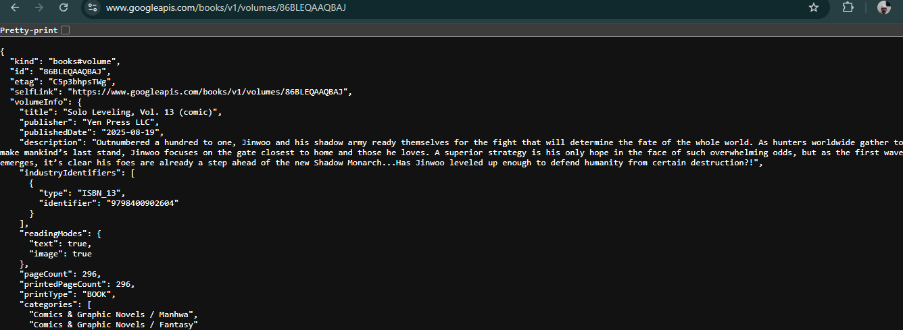

Soal 3

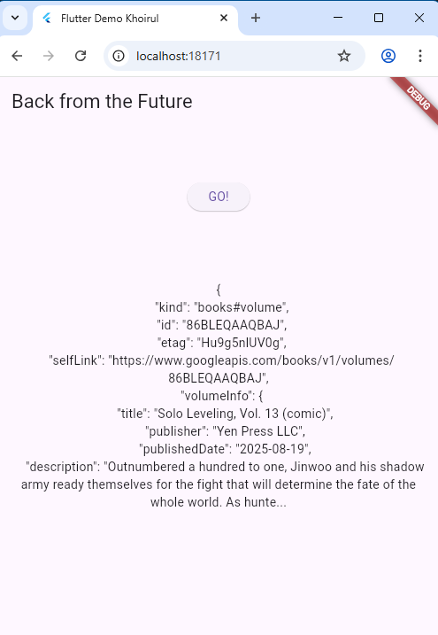

substring(0, 450): Ini adalah metode String yang digunakan untuk memotong teks hasil (body respons API) dan hanya mengambil 450 karakter pertama saja. Tujuannya adalah untuk menghindari tampilan teks yang terlalu panjang di UI.

.catchError((_) { ... }): Ini adalah bagian dari penanganan Future (panggilan asinkron ke API). Fungsinya adalah untuk menangkap dan mengurus kesalahan (error) yang mungkin terjadi selama proses pengambilan data, seperti masalah jaringan atau URL yang salah. Jika terjadi error, variabel result akan diisi dengan pesan 'An error occurred'.

# Praktikum 2

Soal 4

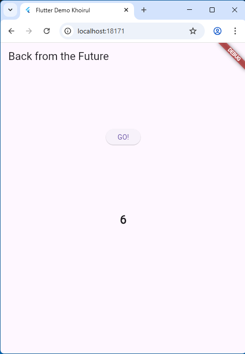

Langkah 1: Tambah tiga method async (returnOneAsync(), returnTwoAsync(), returnThreeAsync())Maksud Kode: Ketiga method ini didefinisikan sebagai asinkron (async) dan mengembalikan sebuah Future<int>. Fungsi utamanya adalah untuk mensimulasikan operasi yang memakan waktu (seperti menunggu data dari server) dengan menggunakan await Future.delayed(Duration(seconds: 3)). Setiap method ini akan menunggu selama 3 detik sebelum mengembalikan nilai integer (1, 2, atau 3).

Langkah 2: Tambah method count()Maksud Kode: Method count() juga didefinisikan sebagai asinkron (async). Di dalam method ini, kata kunci await digunakan untuk:Menjeda eksekusi method count() hingga returnOneAsync() selesai (3 detik).Setelah selesai, nilai yang dikembalikan (1) ditambahkan ke total.Proses ini diulang secara berurutan untuk returnTwoAsync() dan returnThreeAsync().Hasilnya: Penggunaan await memastikan bahwa operasi dijalankan secara serial (berurutan), sehingga total waktu eksekusi adalah $3 + 3 + 3 = 9$ detik, sebelum hasil akhirnya (6) ditampilkan di UI.

Soal 5

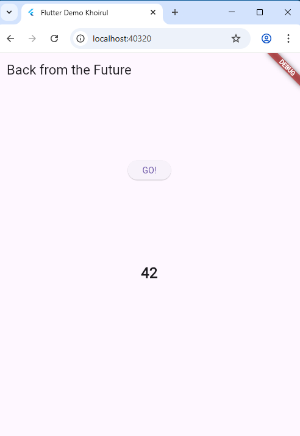

getNumber() memberikan Future instan kepada caller, dan calculate() memenuhi janji tersebut (completer.complete(42)) setelah jeda 5 detik.

Soal 6

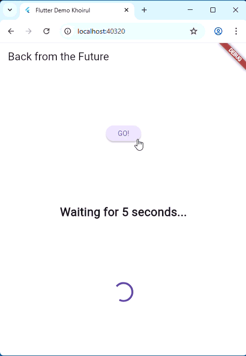

- Langkah 2 hanya bisa mengirimkan nilai sukses (42).

- Langkah 5-6 bisa mengirimkan nilai sukses (42) ATAU pesan error (An error occurred), membuat kode asinkron lebih tangguh.

Soal 7

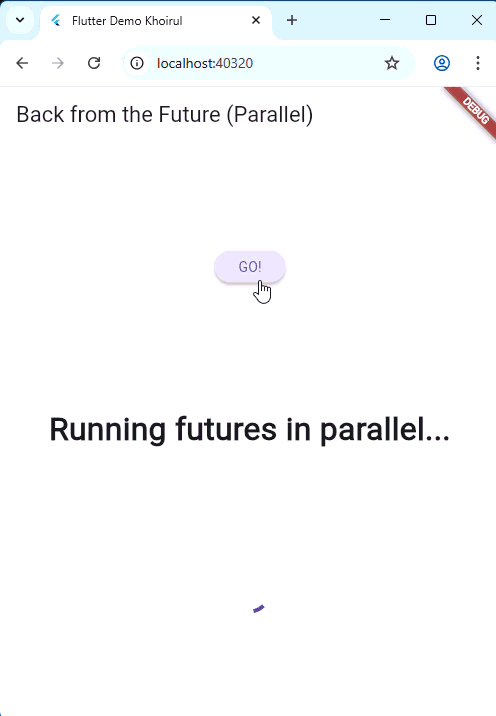

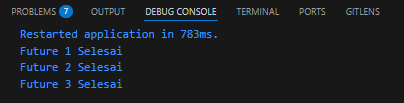

Soal 8


- FutureGroup (Langkah 1) memberikan lebih banyak kontrol dan kemampuan untuk menambahkan Future secara dinamis, tetapi memerlukan package eksternal.

- Future.wait (Langkah 4) adalah cara yang paling ringkas dan standar (bawaan Dart) untuk menjalankan sekumpulan Future secara paralel ketika semua Future sudah diketahui di awal.

soal 9

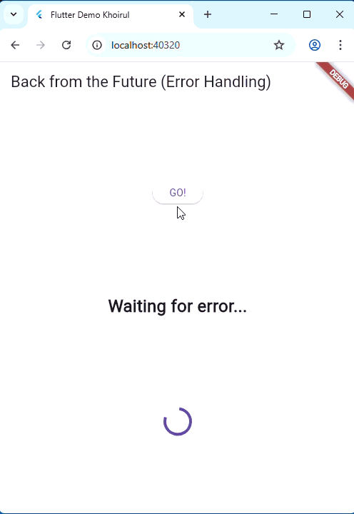

Soal 10

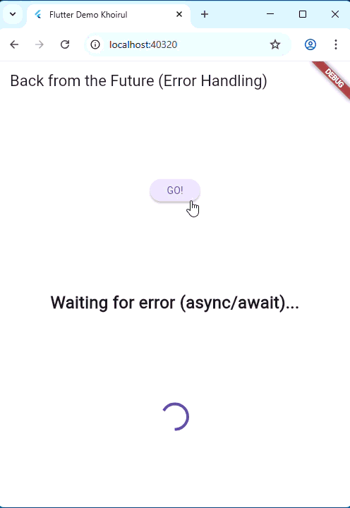

Langkah 1 dan 2 menggunakan gaya callback tradisional (.then()), sedangkan Langkah 4 (handleError()) menggunakan sintaks async/await untuk membuat kode asinkron terlihat dan terasa seperti kode yang berjalan secara berurutan (sinkron), menjadikannya lebih bersih dan mudah dirawat.

Soal 11


Soal 12

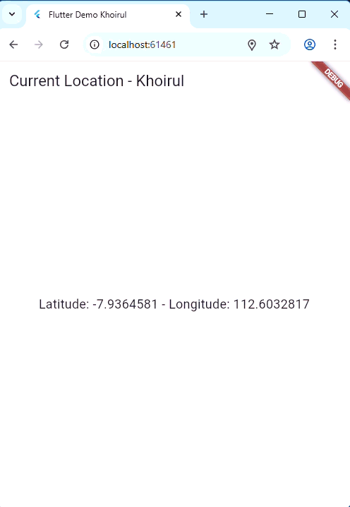

Apakah Anda mendapatkan koordinat GPS ketika run di browser? Mengapa demikian?

Iya bisa. Selama browser mendukung API Geolocation dan mengizinkan akses lokasi melalui pop-up izin peramban, maka akan mendapatkan koordinat GPS, bahkan tanpa konfigurasi native (seperti AndroidManifest.xml) yang hanya diperlukan untuk device mobile.

Soal 13

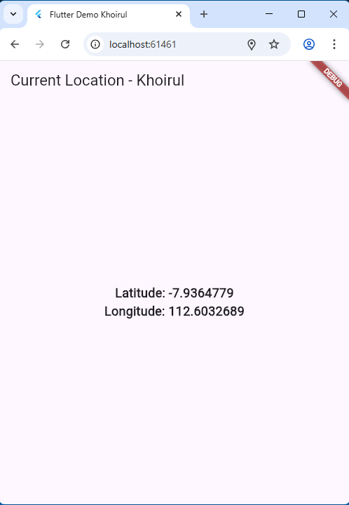

Secara visual, tidak ada perbedaan yang signifikan pada UI saat aplikasi sedang berjalan.

Alasan Mengapa UI Terlihat Sama:

Tidak adanya perbedaan visual yang signifikan adalah karena kedua pola kode tersebut bertujuan untuk mencapai hasil akhir yang sama: menampilkan loading indicator saat data belum siap, dan menampilkan data lokasi ketika data sudah tersedia.

Perbedaan utama terletak pada cara state tersebut dikelola di balik layar (di Dart):

Praktikum 6 (Manual): Kita harus secara eksplisit mengelola state myPosition dan memanggil setState(() { ... }) dua kali (sekali saat awal dan sekali saat data selesai) untuk memberitahu Flutter agar membangun ulang UI.

Praktikum 7 (FutureBuilder): Kita tidak perlu memanggil setState(). FutureBuilder adalah widget cerdas yang secara internal mendengarkan perubahan status pada objek Future (position). Ketika Future selesai, FutureBuilder secara otomatis memanggil setState() untuk dirinya sendiri, sehingga memperbarui UI secara reaktif dan efisien.

Oleh karena itu, secara fungsionalitas dan reaktivitas, FutureBuilder jauh lebih unggul dan clean (bersih) dibandingkan pola manual di initState

Soal 14


Tidak ada perbedaan UI yang terlihat selama aplikasi berjalan normal (sukses), tetapi ada perbedaan signifikan pada UI saat terjadi error.

Soal 15 - 16

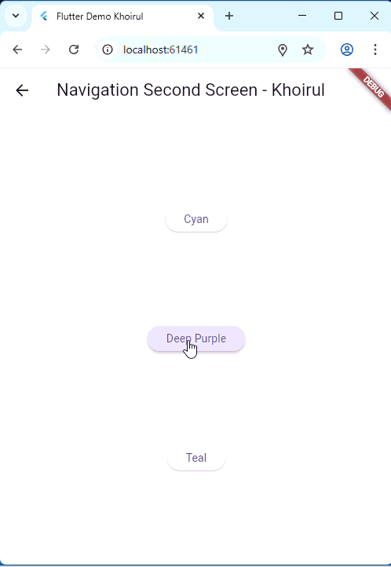

soal 17

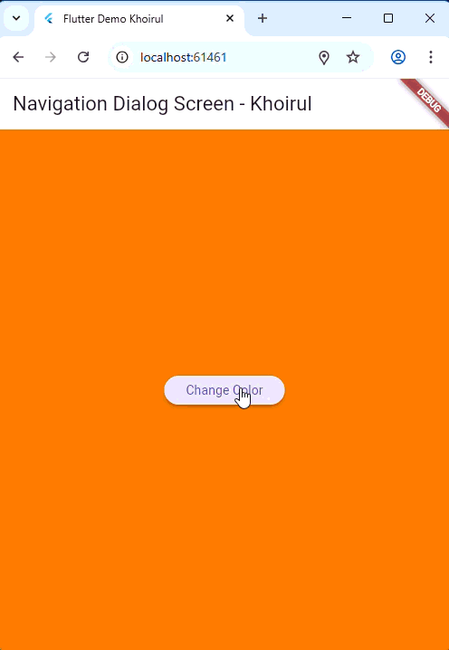