Nama: Muhammad Khoirul Anwarudin

Class: TI3I

NIM: 24410702003

# Soal 1

```dart
class MyApp extends StatelessWidget {
  const MyApp({super.key});

  @override
  Widget build(BuildContext context) {
    return MaterialApp(
      title: 'Stream - Khoirul',
      theme: ThemeData(
        primarySwatch: Colors.teal,
      ),
      home: const StreamHomePage(),
    );
  }
}
```

```dart
class _StreamHomePageState extends State<StreamHomePage> {
  @override
  Widget build(BuildContext context) {
    return Scaffold(
      appBar: AppBar(title: const Text('Aplikasi Stream - Khoirul')),
      body: Center(
        child: Text(
          'Halaman Utama Streams',
          style: Theme.of(context).textTheme.headlineMedium,
        ),
      ),
    );
  }
}
```

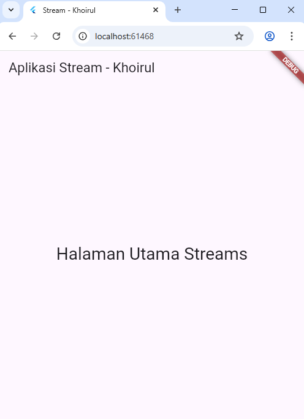

# Soal 2

```dart
import 'package:flutter/material.dart';

class ColorStream {
  final List<Color> colors = [
    Colors.blueGrey,
    Colors.amber,
    Colors.deepPurple,
    Colors.lightBlue,
    Colors.teal,

    Colors.red,
    Colors.green,
    Colors.pink,
    Colors.orange,
    Colors.indigo,
  ];
}
```


# Soal 3

```dart
yield* Stream.periodic(
  const Duration(seconds: 1), (int t) {
    int index = t % colors.length;
    return colors[index];
});
```

Jelaskan fungsi keyword yield* pada kode tersebut!
Apa maksud isi perintah kode tersebut?

Jawaban:

1. Fungsi Keyword yield*:

  - Fungsi dari yield* (baca: yield star) adalah untuk mendelegasikan pengeluaran (emitting) item dari satu generator (async* atau sync* function) ke generator lain atau, dalam kasus ini, ke Stream lain.

  - Secara spesifik, yield* mengambil semua elemen dari Stream yang dioperasikan (Stream.periodic dalam kasus ini) dan "mengeluarkannya" (yields them) satu per satu ke dalam Stream yang sedang didefinisikan (getColors()). Ini memungkinkan getColors() untuk menjadi penghubung langsung ke Stream yang dihasilkan oleh Stream.periodic.

2. Maksud Isi Perintah Kode:

  - Perintah kode tersebut membuat Stream periodik yang akan mengeluarkan (emit) salah satu dari sepuluh warna di dalam colors setiap 1 detik, mengulangi urutan warna tersebut secara terus-menerus.

# Soal 4

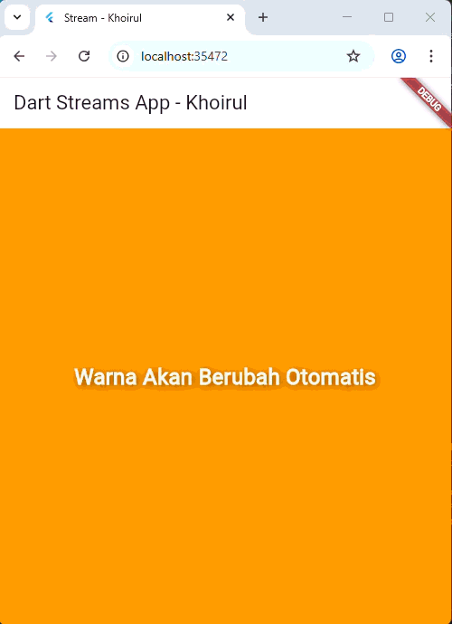

Soal 5

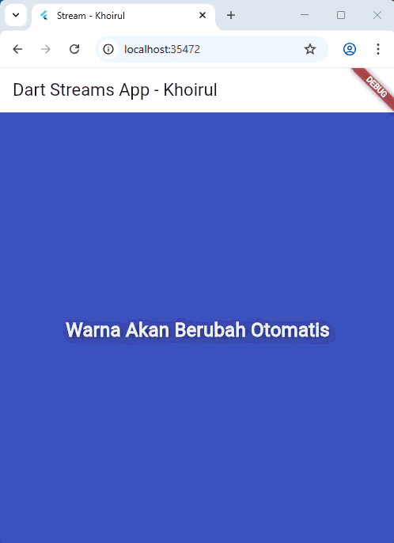

| Fitur        | await for                                                                 | listen()                                                                                  |
|--------------|---------------------------------------------------------------------------|-------------------------------------------------------------------------------------------|
| **Sifat**    | *Blocking* (menunggu), synchronous di dalam fungsi `async`.               | *Non-blocking* (asynchronous), event-driven.                                              |
| **Kapan Berhenti** | Berhenti hanya ketika fungsi `async` yang mengandungnya selesai, atau Stream selesai. | Perlu dihentikan secara eksplisit (misalnya di `dispose()` dengan `StreamSubscription`). |
| **Penggunaan Umum** | Untuk memproses semua event secara berurutan di dalam satu fungsi hingga Stream selesai. | Untuk menangani event secara *real-time* di UI (seperti `setState`) dan tetap memungkinkan kode lain berjalan secara paralel. |


# Soal 6

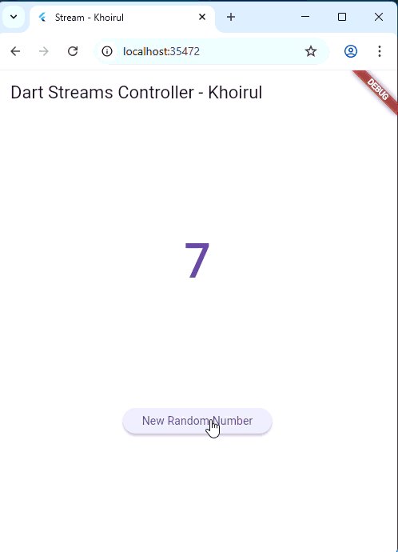

Maksud Kode Langkah 8 (initState()):

Menginisialisasi controller dan stream, lalu mulai mendengarkan stream tersebut. Setiap kali stream mengeluarkan angka baru (event), state (lastNumber) diperbarui dan UI di-render ulang.

Maksud Kode Langkah 10 (addRandomNumber()):

Menghasilkan angka acak dari 0 hingga 9 dan mengirimkannya ke sink dari NumberStream controller. Angka ini kemudian menjadi event baru di stream.

# Soal 7

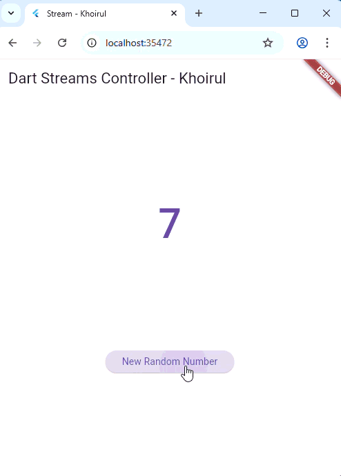

Langkah 13 (addError()): Menambahkan method yang sengaja mengirimkan objek error ke dalam stream melalui sink controller.

Langkah 14 (onError): Menambahkan handler onError pada listener yang bertugas menangkap error yang dikirimkan oleh stream dan memperbarui UI (lastNumber = -1).

Langkah 15 (Edit addRandomNumber()): Mengubah fungsi tombol agar langsung memicu pengiriman error (Langkah 13), bukan angka acak, untuk menguji penanganan error (Langkah 14).

# Soal 8

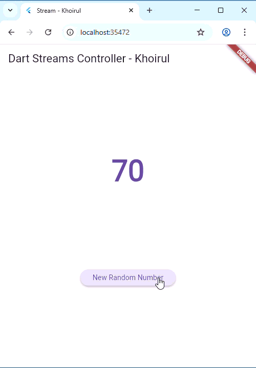

Langkah 1-2 (Deklarasi dan Inisialisasi transformer): Membuat objek StreamTransformer yang bertugas memodifikasi data (event). Setiap angka yang masuk akan dikalikan 10 (handleData), dan setiap error yang masuk akan diganti menjadi nilai data -1 (handleError).

Langkah 3 (Penerapan transform): Menerapkan transformer ke stream sebelum didengarkan (.listen). Ini memastikan bahwa setiap angka yang diterima dari controller akan diubah (dikali 10 atau diganti -1) sebelum ditampilkan di UI.

# Soal 9

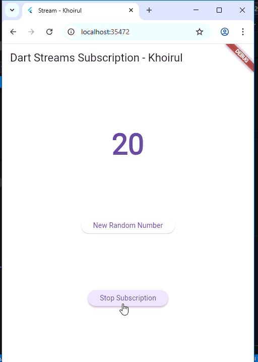

Langkah 2 (Edit initState()): Melakukan langganan (subscribe) ke stream yang telah dimodifikasi oleh transformer dan menyimpan hasilnya ke variabel subscription. Ini memungkinkan langganan dikontrol (pause, resume, cancel).

Langkah 6 (dispose() dengan subscription.cancel()): Membatalkan langganan stream ketika objek State widget dimusnahkan. Hal ini penting untuk mencegah kebocoran memori (memory leak) karena listener stream akan berhenti bekerja.

Langkah 8 (Edit addRandomNumber()): Menambahkan validasi (!numberStreamController.isClosed). Jika stream sudah ditutup (dibatalkan), data baru dicegah untuk dikirim, dan UI diperbarui untuk menunjukkan stream sudah tidak aktif.

# Soal 10

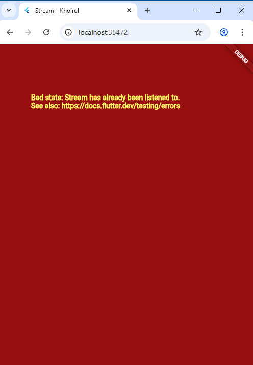

Error Bad State: Stream has already been listened to. terjadi karena stream yang digunakan (yaitu stream yang berasal dari NumberStreamController) adalah stream Single-Subscription (langganan tunggal) secara default.

# Soal 11

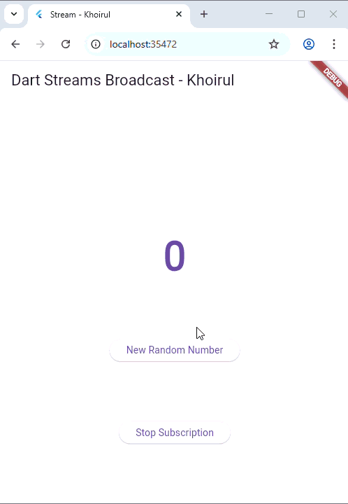

Stream telah diubah menjadi Broadcast Stream menggunakan asBroadcastStream() (Langkah 4).

- Broadcast Stream: Stream jenis ini mengizinkan banyak listener aktif secara bersamaan.

- Mekanisme: Ketika satu event (myNum) dikirim ke sink, Broadcast Stream akan mengirimkan event tersebut ke semua listener yang terdaftar (subscription dan subscription2).

- Hasil: Karena setiap listener menjalankan setState(() { values += '$event - '; });, setiap angka yang dikirim akan dicetak dua kali ke dalam variabel values, yang kemudian ditampilkan di UI.

# Soal 12

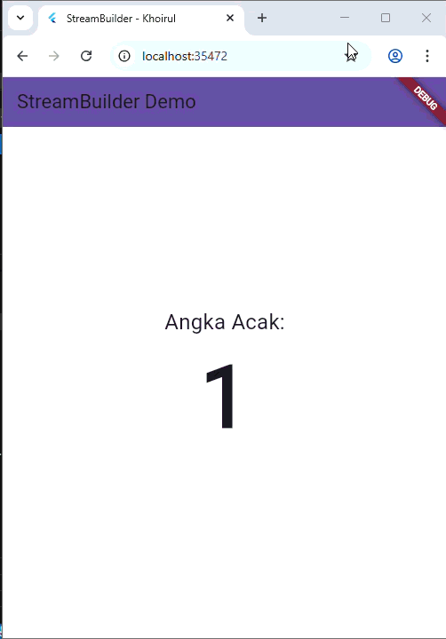

Langkah 3 (getNumbers()): Mendefinisikan Stream yang akan mengeluarkan angka acak (0-9) secara periodik setiap 1 detik selama aplikasi berjalan.

Langkah 7 (StreamBuilder): Widget ini mendengarkan (stream: numberStream) angka yang dikirim oleh stream tersebut. Setiap kali angka baru diterima, builder akan dibangun ulang (rebuild) untuk menampilkan angka terbaru (snapshot.data.toString()) di tengah layar.

# Soal 13

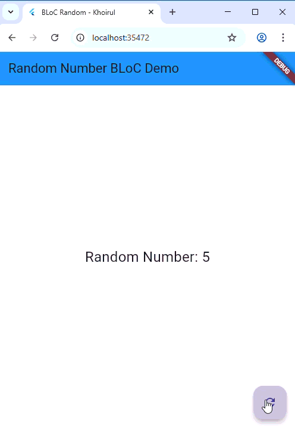

1. Maksud Praktikum (BLoC Pattern):

- Tujuannya adalah untuk memisahkan Logika Bisnis (menghasilkan angka acak) dari Lapisan Presentasi (tampilan UI dan tombol).

- BLoC bertindak sebagai handler antara input pengguna dan state aplikasi, menjamin kode UI bersih dan logika mudah diuji.

2. Letak Konsep Pola BLoC:

- Input Event (Sink): Tombol FloatingActionButton tidak memanggil fungsi logika secara langsung, tetapi mengirimkan event ke Input Sink BLoC (_bloc.generateRandom.add(null)).

- Logika Bisnis (BLoC): Kelas RandomNumberBloc menerima event dari Sink, menjalankan logika (Random().nextInt(10)), dan mengirimkan hasilnya ke Output Stream.

- Output State (Stream): Widget StreamBuilder di RandomScreen mendengarkan Output Stream BLoC (_bloc.randomNumber) dan membangun UI ulang secara reaktif ketika angka baru tersedia, tanpa perlu setState().