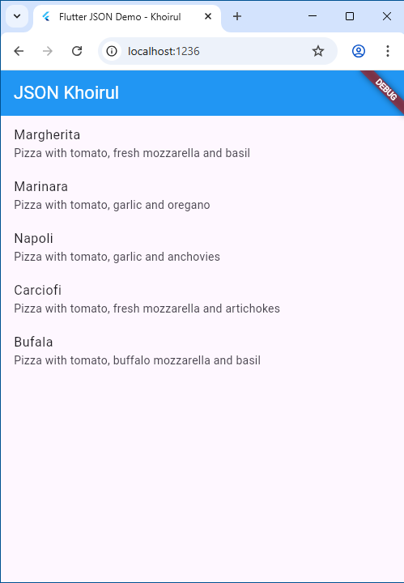
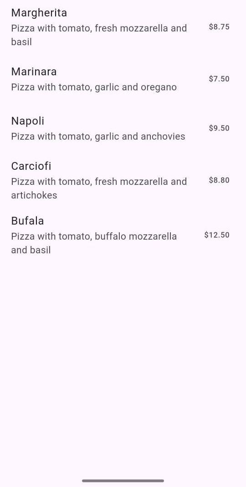
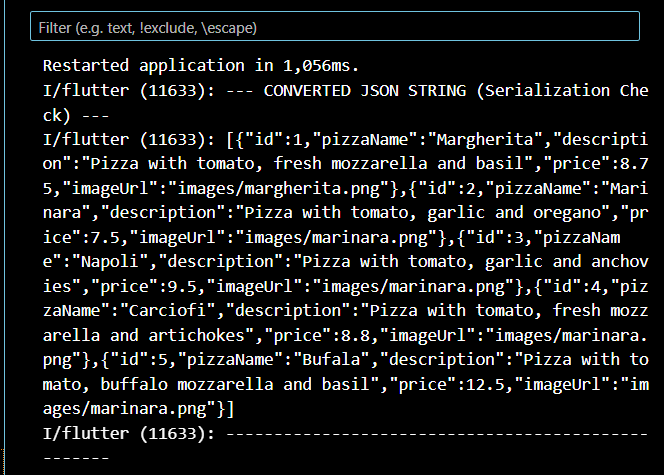
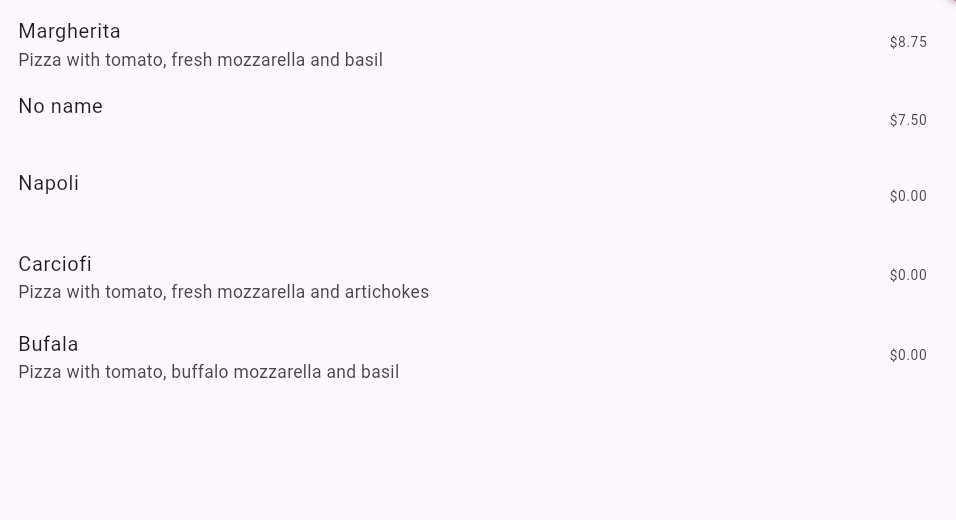
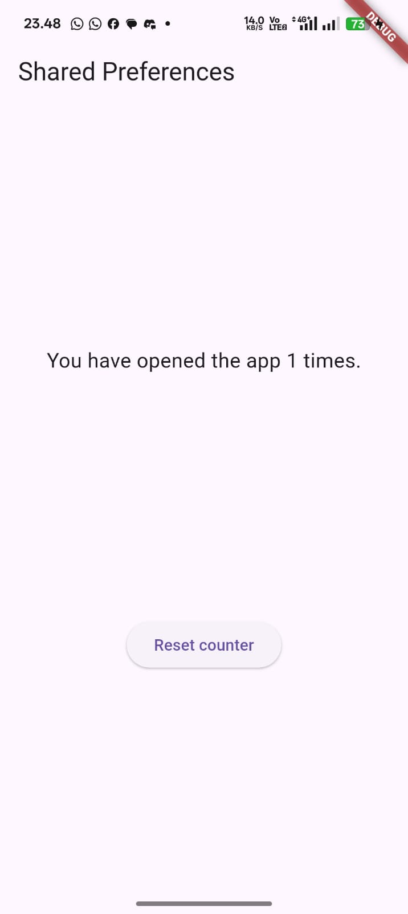
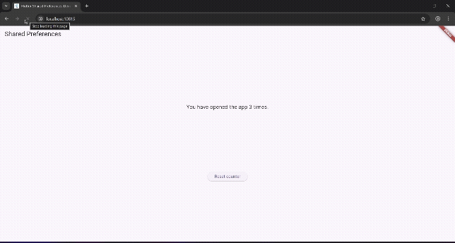
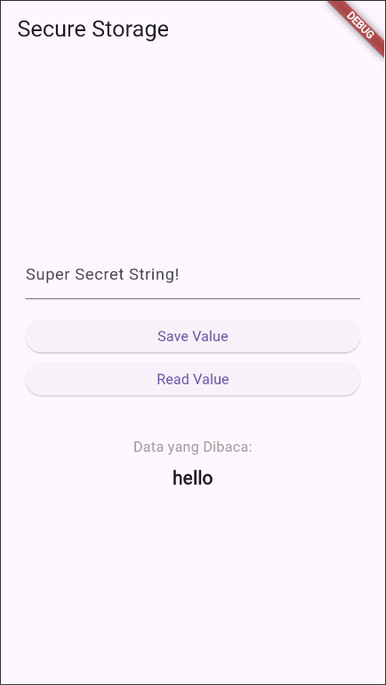

# Codelab_13

## Practical 1: Convert Dart model to JSON

Note: It is assumed that you have successfully setup the Flutter SDK environment, VS Code, Flutter Plugin, and Android SDK in the first meeting.

### Step 1: Create a New Project
Create a new flutter project named store_data_nama (give it your nickname) in the week-13/src/ folder of your GitHub repository.

### Step 2: Open the filemain.dart
Type the code as follows.

```dart:
import 'package:flutter/material.dart';

void main() {
  runApp(const MyApp());
}

class MyApp extends StatelessWidget {
  const MyApp({super.key});

  @override
  Widget build(BuildContext context) {
    return MaterialApp(
      title: 'Flutter JSON Demo - Khoirul',
      theme: ThemeData(
        primarySwatch: Colors.green,         ),
      home: const MyHomePage(),
    );
  }
}

class MyHomePage extends StatefulWidget {
  const MyHomePage({super.key});

  @override
  State<MyHomePage> createState() => MyHomePageState();
}

class MyHomePageState extends State<MyHomePage> {
  @override
  Widget build(BuildContext context) {
    return Scaffold(
      appBar: AppBar(title: const Text('JSON')),
      body: Container(),
    );
  }
}
```


- Question 1
Add your nickname to titlethe app as an identity for your work.
Change the application theme color according to your preference.
Commit the answer to Question 1 with the message "W13: Answer to Question 1"


### Step 3: Create a new folderassets
Create a new folder assets in the root of your project



### Step 4: Create a new filepizzalist.json
Place this file inside the assets, then copy the following JSON data into the file.
```dart:
[ 
    { 
      "id": 1, 
      "pizzaName": "Margherita", 
      "description": "Pizza with tomato, fresh mozzarella and basil",
      "price": 8.75, 
      "imageUrl": "images/margherita.png" 
    }, 
    { 
      "id": 2, 
      "pizzaName": "Marinara", 
      "description": "Pizza with tomato, garlic and oregano",
      "price": 7.50, 
      "imageUrl": "images/marinara.png"  
    }, 
    { 
      "id": 3, 
      "pizzaName": "Napoli", 
      "description": "Pizza with tomato, garlic and anchovies",
      "price": 9.50, 
      "imageUrl": "images/marinara.png"  
    }, 
    { 
      "id": 4, 
      "pizzaName": "Carciofi", 
      "description": "Pizza with tomato, fresh mozzarella and artichokes",
      "price": 8.80, 
      "imageUrl": "images/marinara.png"  
    }, 
    { 
      "id": 5, 
      "pizzaName": "Bufala", 
      "description": "Pizza with tomato, buffalo mozzarella and basil",
      "price": 12.50, 
      "imageUrl": "images/marinara.png"  
    }
]
```
If you want to use other JSON data, you can access one of the API lists at this link: https://github.com/public-apis/public-apis

Step 5: Editpubspec.yaml
Add a folder reference assetsto the pubspec.yaml file as follows.
assets:

- assets/


Step 6: Editmaint.dart
Create a variable like the following class _MyHomePageState.
```dart:
  // Step 6: Deklarasi variabel state untuk menyimpan String JSON mentah
  String pizzaString = ""; 
```


Step 7: Stay inmain.dart
To read the contents of the file pizzalist.jsonin the _MyHomePageState class, add a method readJsonFilelike the following code to read the json file.
```dart:
Future readJsonFile() async {
    String myString = await DefaultAssetBundle.of(context)
        .loadString('assets/pizzalist.json');
    
    // SetState untuk memperbarui UI dengan data JSON yang dibaca
    setState(() {
      pizzaString = myString;
    });
  }
```


Step 8: Call the readJsonFile method
Call method readJsonFilein initState
```dart:
// Step 8: Panggil readJsonFile di initState
  @override
  void initState() {
    super.initState();
    readJsonFile();
  }
```

Step 9: Display the JSON results
Then display the JSON results in the scaffold body.
body: Text(pizzaString),
```dart:
      body: SingleChildScrollView( // Tambahkan SingleChildScrollView agar teks panjang bisa di-scroll
        padding: const EdgeInsets.all(12.0),
        child: Text(pizzaString),
```

### Step 10: Run
If the code is correct, it should appear as shown in the following image.


- Question 2
Include the screen capture results in your lab report.


Commit the answer to Question 2 with the message "W13: Answer to Question 2"


### Step 11: Create a new filepizza.dart
We want to convert the JSON data from a String to a List object. So, we need to create a new class file in the folder lib/modelnamed pizza.dart.


Step 12: Model pizza.dart
Type the following code in the filepizza.dart

```dart:
// Step 12: Pizza class model
class Pizza {
  final int id;
  final String pizzaName;
  final String description;
  final double price;
  final String imageUrl; // Corrected from imageUr1
  ```

### Step 13: Createconstructor()
Inside the class Pizzadefine a constructor fromJson, which will take data in the form of a Map as a parameter and convert the Map to a Pizza object like the following code:


```dart:
// Step 13: Factory constructor for Deserialization (JSON to Dart Object)
  Pizza.fromJson(Map<String, dynamic> json)
      : id = json['id'] as int,
        pizzaName = json['pizzaName'] as String,
        description = json['description'] as String,
        price = json['price'] is int // Handle JSON number being int or double
            ? (json['price'] as int).toDouble()
            : json['price'] as double,
        imageUrl = json['imageUrl'] as String; // Corrected from imageUr1
}
```

### Step 14: Move toclass _MyHomePageState
Add jsonDecode code as follows.
```dart:  
Future<List<Pizza>> readJsonFile() async {
    String myString = await DefaultAssetBundle.of(context)
        .loadString('assets/pizzalist.json');
    
    // Step 14: Decode the JSON string into a List of Maps
    List pizzaMapList = jsonDecode(myString);
```


### Step 15: Make sure to import the class
Note at the top of the file that the following two files have been successfully imported.
```dart:
// Step 15: Import 'dart:convert' for JSON decoding/encoding
import 'dart:convert';
// Step 15: Import the Pizza model
import './model/pizza.dart';
```


You've successfully imported the necessary libraries and decoded the JSON string into a pizzaMapList in this step. Next, we'll convert that MapList into a List of Dart objects (List<Pizza>).

### Step 16: Convert Map List to Dart Object List
In the readJsonFile() method, after the line List pizzaMapList = jsonDecode(myString);, add the following code to convert each Map in pizzaMapList into a Pizza object and save it to myPizzas.
```dart:
// Step 16: Convert Map List to Dart Object List (List<Pizza>)
    List<Pizza> myPizzas = [];
    for (var pizza in pizzaMapList) {
      Pizza myPizza = Pizza.fromJson(pizza as Map<String, dynamic>);
      myPizzas.add(myPizza);
    }
```


### Step 17: return myPizzas
Delete or comment out setStatethe displays pizzaStringfrom Step 7. Then, revert back to myPizzas.

```dart:
// NOTE: Step 17 instruction to delete/comment out setState(pizzaString = myString)
    // is applied here by not including it. The raw pizzaString variable is now obsolete
    // and can be deleted/commented out from Step 6, which I've done above.

    // Step 17: Return the List of Pizza objects
    return myPizzas;
  }
```


### Step 18: Update Signature Method
Update the method signature readJsonFile()to explicitly indicate that it returns Futurea containing .List
```dart:
// Step 18: Update method signature to return Future<List<Pizza>>
  Future<List<Pizza>> readJsonFile() async {
```


### Step 19: Declare State Variables
Inside class _MyHomePageState, declare a new state variable to hold the List of Pizza objects.
```dart:
// Step 19: Declare state variable to hold the list of Pizza objects
  List<Pizza> myPizzas = [];
```


### Step 20: Call on initState and Update State
Update the method initState()to _MyHomePageStatecall readJsonFile(). Since readJsonFile()it returns Future, use it .then()to get the result, and update the state myPizzas.

```dart:
// Step 20: Call on initState and Update State
  @override
  void initState() {
    super.initState();
    readJsonFile().then((value) {
      setState(() {
        myPizzas = value;
      });
    });
  }
```


### Step 21: Display Data in ListView
Update the body of the Scaffold to use a ListView.builder that displays pizzaName as the title and description as the subtitle of each Pizza object.

```dart:
@override
  Widget build(BuildContext context) {
    return Scaffold(
      appBar: AppBar(title: const Text('JSON')),
      // Step 21: Display Data in ListView
      body: ListView.builder(
        itemCount: myPizzas.length,
        itemBuilder: (context, index) {
          return ListTile(
            title: Text(myPizzas[index].pizzaName),
            subtitle: Text(myPizzas[index].description),
            trailing: Text('\$${myPizzas[index].price.toStringAsFixed(2)}'),
          );
        },
```

### Step 22: Run
Run the application. You should now see the pizza data displayed in a more structured list as a Dart List object.


- Question 3
Include the screen capture results in your lab report.



Commit the answer to Question 2 with the message "W13: Answer to Question 3"

### Step 23: Add toJson() Method (Serialization)
In the pizza.dart file, add the toJson() method to the Pizza class. This method converts the Dart object back to a Map (the first step towards a JSON String).
```dart:
  // Step 23: Serialization (Dart Object to Map)
  Map<String, dynamic> toJson() {
    return {
      "id": id,
      "pizzaName": pizzaName,
      "description": description,
      "price": price,
      "imageUrl": imageUrl,
    };
  }
```


### Step 24: Create a JSON String Conversion Function
In main.dart, add a convertToJSON function inside _MyHomePageState to use jsonEncode (from dart:convert) which converts a List of Dart objects to a JSON String.

```dart:
// Step 24: Function to convert List<Pizza> back to a JSON String (Serialization)
  String convertToJSON(List<Pizza> pizzas) {
    // Map each Pizza object to its Map<String, dynamic> representation using toJson()
    List<Map<String, dynamic>> pizzaMapList = pizzas.map((pizza) => pizza.toJson()).toList();
    
    // Encode the list of Maps into a single JSON array string
    return jsonEncode(pizzaMapList);
  }
```

### Step 25: Display JSON Output in Console
In the readJsonFile() method, add code to call convertToJSON and print the result to the Debug Console before returning myPizzas.

```dart:
// Step 25: Call convertToJSON and print the result to the console
    String json = convertToJSON(myPizzas);
    print('--- CONVERTED JSON STRING (Serialization Check) ---');
    print(json);
    print('---------------------------------------------------');

    // Step 17: Return the resulting list of Dart objects
    return myPizzas;
  }
```
### Step 26: Check Console Output
Run the application. Check the Debug Console to see that the List of Pizza objects has been successfully converted back to a JSON String.



## Practical 2: Handle JSON data compatibility


### Step 1: Simulate Error
Suppose you have replaced a file pizzalist.jsonwith inconsistent data.


### Step 2: View String to Int Data Type Error
If the pizza ID in JSON is sent as a String (e.g. "id": "1"in JSON) while the Dart model expects an int, you will see a runtime error.
```dart:
  Pizza.fromJson(Map<String, dynamic> json) :
        id = json['id'],
```


### Step 3: Apply tryParse and Null Coalescing on ID
In Pizza.fromJson (pizza.dart file), change the way you retrieve the id value using int.tryParse and the null coalescing operator (??) to default to 0 if parsing fails or the value is null. This ensures the id value is always an integer.
```dart:
  Pizza.fromJson(Map<String, dynamic> json) :
        id = int.tryParse(json['id'].toString()) ?? 0,
```


### Step 4: Simulate Null Error on String
If you rerun and there are missing fields (e.g. imageUrl is missing), you may get a Null error.
```dart:
imageUrl = json['imageUrl'];
```


### Step 5: Apply Null Coalescing to Strings
Add the null coalescing operator (??) to imageUrl to return an empty string ('') if the received value is null. Do the same for other String fields like pizzaName and description if necessary.
```dart:
imageUrl = json['imageUrl'] ?? '';
```


### Step 6: Use toString() for String Fields
To ensure that all values ​​passed as Strings are actually Strings (even if they might be passed as ints or other types), use toString().

```dart:
  // Step 3, 5, & 6 diterapkan di sini
  Pizza.fromJson(Map<String, dynamic> json) :
      // ID (Step 3 & 6): Aman konversi ke int atau default 0
      id = int.tryParse(json['id'].toString()) ?? 0, 
      
      // ➡️ String Fields (Step 5 & 6)
      // Ambil nilai, ubah ke String, dan gunakan string kosong jika hasilnya null.
      // NOTE: Kita harus memastikan .toString() dipanggil pada nilai non-null, 
      // atau menggunakan sintaks yang lebih aman (seperti yang digunakan di Step 10).
      
      // Menerapkan .toString() dan ?? '' (metode yang paling aman saat ini)
      pizzaName = (json['pizzaName'] ?? '').toString(),
      description = (json['description'] ?? '').toString(),
      
      // Price belum diubah (akan diubah di Step 8)
      this.price = json['keyPrice'], 
      
      // imageUrl (Step 5 & 6)
      imageUrl = (json['imageUrl'] ?? '').toString();
```

Step 7: Simulate String to Double Data Type Error
If you rerun, you may encounter an error when converting String to Double for the price field.
```dart:
      // Price belum diubah (akan diubah di Step 8)
      this.price = json['keyPrice'], 
```


Step 8: Implement double.tryParse
Apply double.tryParse with null coalescing (??0) for the price field, just as you did for id.
```dart:
      // ➡️ Step 8 (PRICE: String ke Double)
      price = double.tryParse(json['price'].toString()) ?? 0.0,
```


Step 9: Run and Observe Null Output
After implementing all data type fixes, the application will run, but may display "null" in the UI if any fields are missing or fail to parse (such as pizzaName or description).


### Step 10: Add Ternary Operator for User-Friendly Output
Fix the "null" display issue by adding a ternary operator that checks for null before converting it to a String. If it's null, provide a user-friendly replacement value such as 'No name' or the empty string ('').
```dart:
class Pizza {
  final int id;
  final String pizzaName;
  final String description;
  final double price;
  final String imageUrl;

  // Constructor fromJson yang sudah robust
  Pizza.fromJson(Map<String, dynamic> json) :
      // Step 3: ID (sudah aman)
      id = int.tryParse(json['id'].toString()) ?? 0,
      
      // ➡️ Step 10: pizzaName (Menggunakan Ternary Operator)
      // Jika null, gunakan 'No name', jika tidak, konversi ke string
      pizzaName = json['pizzaName'] != null 
          ? json['pizzaName'].toString() 
          : 'No name',
      
      // ➡️ Step 10: description (Menggunakan Ternary Operator)
      // Jika null, gunakan string kosong '', jika tidak, konversi ke string
      description = json['description'] != null
          ? json['description'].toString()
          : '',
      
      // Step 8: PRICE (sudah aman)
      price = double.tryParse(json['price'].toString()) ?? 0.0,
      
      // Step 5 & 6: imageUrl (sudah aman)
      imageUrl = (json['imageUrl'] ?? '').toString(); 
      
  // Metode toJson()
  Map<String, dynamic> toJson() {
    return {
      "id": id,
      "pizzaName": pizzaName,
      "description": description,
      "price": price,
      "imageUrl": imageUrl,
    };
  }
}
```


### Step 11: Run
Run the application. Now the inconsistent data is handled properly, and the UI no longer displays null values.


- Question 4
Capture the results of running your application, then import it into your lab report!
Then do a commit with the message " W13: Answer to Question 4 ".



## Practical 3: Handling JSON errors

### Step 1: Open pizza.dart and Create Constants
At the top of the pizza.dart file, outside the Pizza class, declare constants for each JSON key.
```dart:
// Step 1: Deklarasi Konstanta untuk Kunci JSON
const keyId = 'id';
const keyName = 'pizzaName';
const keyDescription = 'description';
const keyPrice = 'price';
const keyImage = 'imageUrl';
```


### Step 2: Update fromJson() using Constants
In the Pizza.fromJson constructor, replace all JSON key literal strings (e.g. 'id') with the appropriate constant (keyId).

```dart:
// Step 2: Konstruktor fromJson() menggunakan Konstanta dan Robustness
  Pizza.fromJson(Map<String, dynamic> json) :
      // ID: tryParse & ?? 0
      id = int.tryParse(json[keyId].toString()) ?? 0,
      
      // pizzaName: Ternary Operator untuk 'No name'
      pizzaName = json[keyName] != null 
          ? json[keyName].toString() 
          : 'No name',
      
      // description: Ternary Operator untuk '' (string kosong)
      description = json[keyDescription] != null
          ? json[keyDescription].toString()
          : '',
      
      // price: double.tryParse & ?? 0.0
      price = double.tryParse(json[keyPrice].toString()) ?? 0.0,
      
      // imageUrl: Null Coalescing sederhana
      imageUrl = (json[keyImage] ?? '').toString();
```

Note: This constructor uses initialization syntax, but for simplicity, we use body syntax.

### Step 3: Update toJson() using Constants
Also update the toJson() method to use the same constant.

```dart:
// Step 3: Metode toJson() menggunakan Konstanta
  Map<String, dynamic> toJson() {
    return {
      keyId: id,
      keyName: pizzaName,
      keyDescription: description,
      keyPrice: price,
      keyImage: imageUrl,
    };
```


### Step 4: Run
Run the application. There won't be any visual changes, but your code is now safer and more maintainable.


- Question 5
Explain the meaning of safer and more maintainable code!
Capture your lab results and attach them to the README.
Then do a commit with the message " W13: Answer to Question 5 ".

    The code becomes safer because replacing JSON key strings with constants prevents typos that cause runtime errors (application crashes). If a constant is mistyped, the error is detected at compile-time (when writing the code). The code becomes easier to maintain because all JSON key references are controlled from a single location in the pizza.dart file, so future key name changes only need to be made once.

result:


## Lab 4: SharedPreferences

### Step 1: Add Dependencies
In Terminal, add the shared_preferences package.


### Step 2: Install Dependencies
Run flutter pub get if your editor doesn't do it automatically.

### Step 3: Perform Import
In the main.dart file, add an import for shared_preferences.
```dart:
import 'package:shared_preferences/shared_preferences.dart';
```


### Step 4: Add appCounter Variable
Inside the _MyHomePageState class (or whatever State class you are using), declare the appCounter variable.
```dart:
class MyHomePageState extends State<MyHomePage> {
  // Step 4: Tambahkan variabel appCounter
  int appCounter = 0;
```


### Step 5: Create a readAndWritePreference Method
Create an asynchronous methodreadAndWritePreference().
```dart:
// Step 5 - 9: Metode untuk membaca, menambah, dan menyimpan hitungan
  Future readAndWritePreference() async {
```


### Step 6: Get a SharedPreferences Instance
Inside the method, get the SharedPreferences instance. Keep in mind that this is an asynchronous operation, so use await.
```dart:
// Step 6: Dapatkan Shared Preferences Instance
    SharedPreferences prefs = await SharedPreferences.getInstance();
```


### Step 7: Read, Check Null, and Increment Counter
Read the appCounter value from storage. Use null coalescing (??0) to ensure a default value of 0 if no data exists. Then increment the value.
```dart:
// Step 7: Baca, Cek Null (?? 0), dan Tambahkan Counter
    int currentCount = prefs.getInt('appCounter') ?? 0; 
    currentCount++;
```


### Step 8: Save New Values
Save the incremented appCounter value back to storage using prefs.setInt().
```dart:
// Step 8: Simpan Nilai Baru
    await prefs.setInt('appCounter', currentCount);
```


### Step 9: Update State
Call setState() to update the UI with the new value of appCounter.
```dart:
// Step 9: Update State
    setState(() {
      this.appCounter = currentCount;
    });
  }
```


### Step 10: Call initState()
Call readAndWritePreference() in initState() to have the counter read when the app is first opened.
```dart:
// Step 10: Panggil readAndWritePreference di initState
  @override
  void initState() {
    super.initState();
    readAndWritePreference();
  }
```


### Step 11: Update the Appearance (body)
Replace your Scaffold body with a layout that displays a count and a 'Reset counter' button.

```dart:
// Step 11: Update body dengan tampilan hitungan dan tombol reset
      body: Center(
        child: Column(
          mainAxisAlignment: MainAxisAlignment.spaceEvenly,
          children: <Widget>[
            // Tampilkan hitungan
            Text(
              'You have opened the app $appCounter times.',
              style: TextStyle(fontSize: 18),
            ),
            // Tombol Reset
            ElevatedButton(
              // Step 14: Panggil deletePreference()
              onPressed: () {
                deletePreference();
              },
              child: Text('Reset counter'),
            ),
```

### Step 12: Run
The app will now display "You have opened the app 1 times" (if this is the first opening).


Step 13: Create the deletePreference() Method
Add an asynchronous method deletePreference() which is used to delete data using prefs.clear().
```dart:
  // Step 13: Metode untuk menghapus data
  Future deletePreference() async {
    SharedPreferences prefs = await SharedPreferences.getInstance();
    
    // Hapus semua data
    await prefs.clear();
    
    // Reset state lokal
    setState(() {
      appCounter = 0;
    });
  }
```


Step 14: Call deletePreference()
Connect deletePreference() to the 'Reset counter' button.
```dart:
              // Step 14: Panggil deletePreference()
              onPressed: () {
                deletePreference();
              },
```


Step 15: Run
Run the application. The reset button will now work, deleting all key-value pairs and resetting the count.



- Question 6
Capture your practical results in GIF format and attach them to the README.
Then do a commit with the message " W13: Answer to Question 6 ".



## Practical 5: Access the filesystem with path_provider

### Step 1: Add Dependencies

### Step 2: Perform Import
In the main.dart file, add an import for path_provider.
```dart:
import 'package:path_provider/path_provider.dart';
```


### Step 3: Add Path State Variables
In your State class, add variables to store the document and temporary directory paths.
```dart:
  // ➡️ Step 3: Tambahkan variabel state untuk jalur dokumen dan sementara
  String documentsPath = '';
  String tempPath = '';
```


### Step 4: Create the getPaths() Method
Create an asynchronous method getPaths() that uses getApplicationDocumentsDirectory() and getTemporaryDirectory() to retrieve the proper file system paths, then update the state.
```dart:
  // --- Metode Path Provider (Practical 5) ---

  // Step 4 (P5): Metode untuk mendapatkan jalur direktori
  Future getPaths() async {
    // Ambil direktori dokumen aplikasi
    final docDir = await getApplicationDocumentsDirectory(); 
    // Ambil direktori cache sementara
    final tempDir = await getTemporaryDirectory(); 

    setState(() {
      documentsPath = docDir.path;
      tempPath = tempDir.path;
    });
```


### Step 5: Call getPaths() on initState()
Call getPaths() on initState().
```dart:
@override
void initState() {
  super.initState();
  getPaths();
}
```

### Step 6: Update the Display
Update the Scaffold body to show both paths taken.
```dart:
// --- Pemisah Visual ---
            const Divider(),

            // Step 6 (P5): Tampilkan jalur dokumen
            Text(
              'Doc path: $documentsPath',
              textAlign: TextAlign.center,
              style: const TextStyle(fontWeight: FontWeight.bold),
            ),
            // Step 6 (P5): Tampilkan jalur sementara
            Text(
              'Temp path: $tempPath',
              textAlign: TextAlign.center,
              style: const TextStyle(fontWeight: FontWeight.bold),
            ),
```


### Step 7: Run
Run the app. You'll see the absolute path to the app's documents and cache directories on your device.


- Question 7
Capture your lab results and attach them to the README.
Then do a commit with the message " W13: Answer to Question 7 ".


## Practical 6: Accessing the filesystem with directories


### Step 1: Import dart:io
In the main.dart file, add an import for the dart:io library.
```dart:
import 'dart:io'; // Step 1 (P6): Import dart:io
```


### Step 2: Add File and Text Variables
In the State class, add the variables myFile (with the late modifier) ​​and fileText to store the content to be read.
```dart:
// Step 2 (P6): Variabel File dan Text
  late File myFile;
  String fileText = '';
```


### Step 3: Create the writeFile() Method
Create an asynchronous method, writeFile(), that uses myFile.writeAsString() to write the contents to a file. Replace the words 'Margherita, Capricciosa, Napoli' with your full name and student ID number.
```dart:
// Step 3 (P6): Metode untuk menulis ke file
  Future<bool> writeFile() async {
    try {
      // GANTI string ini dengan NAMA LENGKAP dan ID MAHASISWA Anda
      String fileContent = 'Agna, Student ID: 123456789'; 
      
      await myFile.writeAsString(fileContent);
      return true;
    } catch (e) {
      return false;
    }
  }
```

### Step 4: Initialize File and Call writeFile() in initState()
Update initState(): after getPaths() completes, initialize myFile with the full path in the documents directory, and call writeFile().
```dart:
@override
  void initState() {
    // Step 4 (P6): Inisialisasi File dan panggil writeFile()
    getPaths().then((_) {
      // Inisialisasi myFile dengan jalur lengkap
      myFile = File('$documentsPath/pizzas.txt');
      
      // Tulis file segera setelah inisialisasi
      writeFile();
    });
    
    super.initState();
  }
```


### Step 5: Create the readFile() Method
Create an asynchronous method readFile() that uses myFile.readAsString() to read the file contents and update fileText via setState().
```dart:
// Step 5 (P6): Metode untuk membaca file
  Future<bool> readFile() async {
    try {
      String fileContent = await myFile.readAsString();
      
      setState(() {
        fileText = fileContent; // Perbarui state untuk menampilkan konten
      });
      return true;
    } catch (e) {
      fileText = "Error: File not found or couldn't be read.";
      setState(() {
        this.fileText = fileText;
      });
      return false;
    }
  }
```


### Step 6: Edit build() and Add Read Button
In the build() method, add an ElevatedButton that calls readFile() and a Text that displays the fileText below it.
```dart:
// Step 6 (P6): Tombol Baca File
            ElevatedButton(
              onPressed: () {
                readFile(); // Panggil fungsi baca file
              },
              child: const Text('Read File'),
            ),
            
            const SizedBox(height: 20),
            
            // Step 6 (P6): Tampilkan konten file
            Text(
              fileText,
              textAlign: TextAlign.center,
              style: const TextStyle(fontSize: 16, color: Colors.deepPurple),
            ),
```


### Step 7: Run
Run the application. After pressing the 'Read File' button, the written content (Margherita, Capricciosa, Napoli) will be displayed, along with your name and student ID number.


- Question 8
Explain the meaning of the code in steps 3 and 7!
Capture your practical results in GIF format and attach them to the README.
Then do a commit with the message " W13: Answer to Question 8 ".

Code Explanation
  1. Code in Step 3 (writeFile()): This code is used to asynchronously write or overwrite data to a file. The await myFile.writeAsString(...) method takes the given string and saves it to the file location specified by the myFile variable. Using await ensures that the I/O (Input/Output) operation completes before continuing execution, and try-catch ensures that I/O errors are handled gracefully (by returning false).

  2. Code in Step 7 (Referring to readFile() in Step 5): This code is used to read data from a file that has been written. The await myFile.readAsString() method retrieves the string content from the file pointed to by myFile. Once the content is successfully read, setState() is called to update the fileText variable, which automatically re-renders the UI, displaying the read content (student name and ID) on the screen.


## Practical 7: Storing data with encryption/decryption

### Step 1: Add Dependencies
Add the flutter_secure_storage package via Terminal.


### Step 2: Perform Import
In main.dart, import the required packages.
```dart:

// Step 2: Import package flutter_secure_storage
import 'package:flutter_secure_storage/flutter_secure_storage.
```

### Step 3: Add Variables and Controller
In the State class (_MyHomePageState), add a TextEditingController and a variable to store the read password.

```dart:
class MyHomePageState extends State<MyHomePage> {
  // Step 3: Controller untuk input teks dan variabel untuk output
  final pwdController = TextEditingController();
  String myPass = '';
```


### Step 4: Initialize Secure Storage
In the State class, initialize FlutterSecureStorage and define its key.
```dart:
// Step 4: Inisialisasi storage dan kunci
  final storage = const FlutterSecureStorage();
  final myKey = 'myPass';
```


### Step 5: Create the writeToSecureStorage() Method
Create an asynchronous method to write data from pwdController to secure storage.
```dart:
// --- Metode Secure Storage ---

  // Step 5: Metode untuk menulis ke secure storage
  Future writeToSecureStorage() async {
    // Tulis nilai dari controller ke storage
    await storage.write(key: myKey, value: pwdController.text);
    // Bersihkan input field setelah menyimpan
    pwdController.clear(); 
  }
```


### Step 6: Create the readFromSecureStorage() Method
Create an asynchronous method to read data from secure storage.
```dart:
// Step 6: Metode untuk membaca dari secure storage
  Future<String> readFromSecureStorage() async {
    // Baca nilai dari storage, default '' jika tidak ada
    String secret = await storage.read(key: myKey) ?? '';
    return secret;
  }
```


### Step 7: Edit build() for UI and Logic
Update the build() method to include a TextField and two ElevatedButtons (Save Value and Read Value). Connect the save method to the Save Value button.
```dart:
// Step 7: TextField untuk input
              TextField(
                  controller: pwdController,
                  decoration: const InputDecoration(labelText: 'Super Secret String!'),
              ),
              const SizedBox(height: 20),
              
              // Step 7: Tombol Save Value
              ElevatedButton(
                  child: const Text('Save Value'),
                  onPressed: () {
                      writeToSecureStorage();
                  },
              ),
```

### Step 8: Connect Read to Button
Connect the read method to the Read Value button, update myPass and the UI via setState().
```dart:
// Step 8: Tombol Read Value
              ElevatedButton(
                  child: const Text('Read Value'),
                  onPressed: () {
                      readFromSecureStorage().then((value) {
                          setState(() {
                              myPass = value; // Perbarui state dengan nilai yang dibaca
                          });
                      });
                  },
```


### Step 9: Run
Run the application. Enter the text, save it, and then read it again. The text should be displayed, indicating the data has been safely saved and retrieved.


- Question 9
Capture your practical results in GIF format and attach them to the README.
Then do a commit with the message " W13: Answer to Question 9 ".

