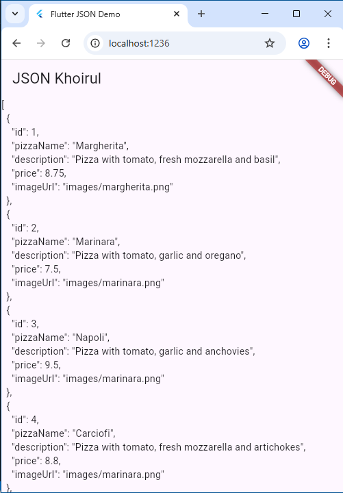

Question 1
- Add your nickname to the app title as your work identity.
- Change the app theme color to your liking.
- Commit your answer to Question 1 with the message “W13: Answer to Question 1.”

```dart
class _MyHomePageState extends State<MyHomePage> {
  @override
  Widget build(BuildContext context) {
    return Scaffold(
      appBar: AppBar(title: const Text('JSON Khoirul')),
      body: Container(),
    );
  }
}
```

Question 2
- Include the screenshot in your lab report.
- Commit your answer to Question 2 with the message “W13: Answer to Question 2.”



Question 3
- Include the screenshot in your lab report.
- Commit your answer to Question 2 with the message “W13: Answer to Question 3.”